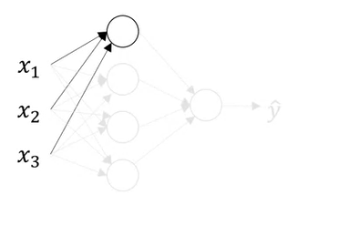
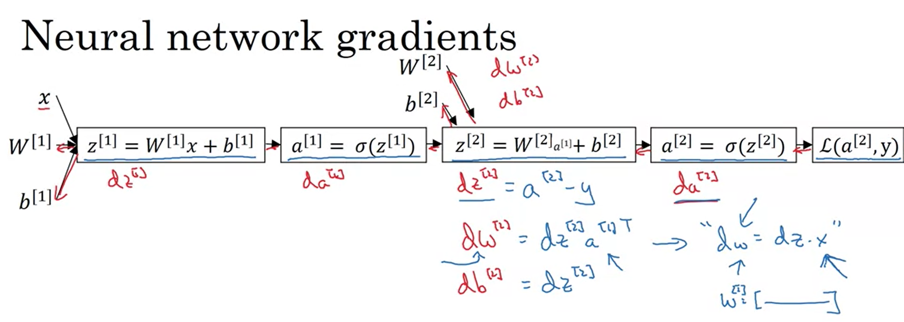
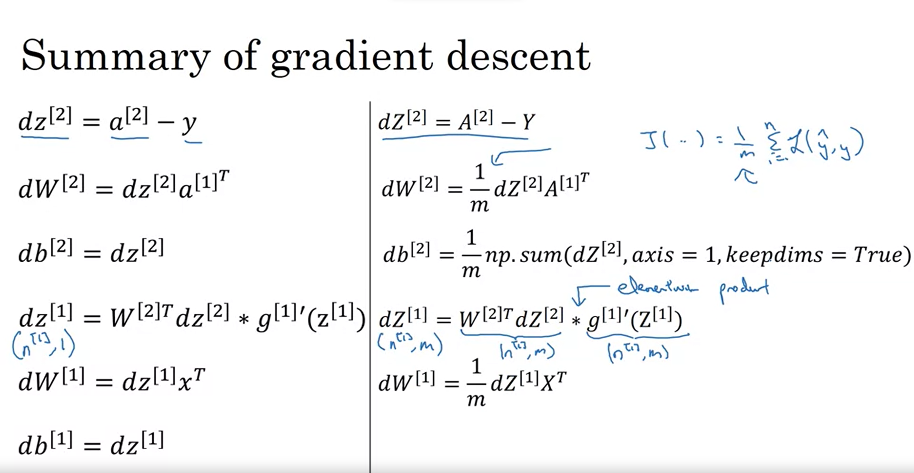
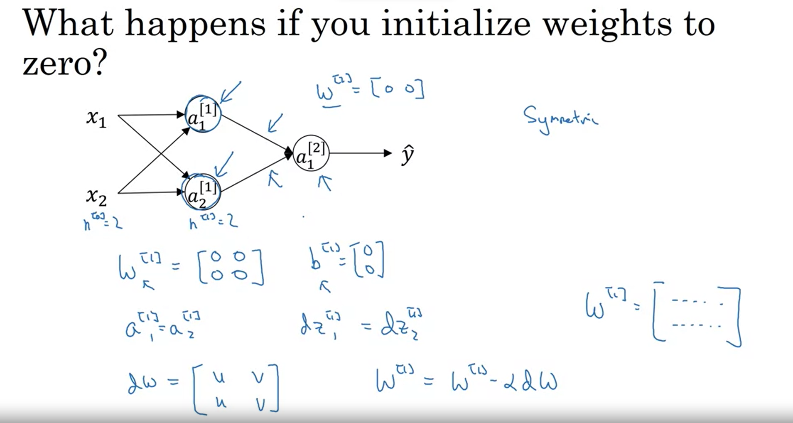
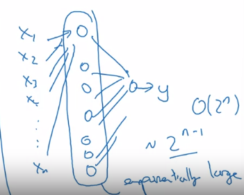

# Coursera DL Note
[Toc]
## Introduction
ReLU Function(Recitified Linear Unit)


- input layer
- hidden layer
- output layer 

### Neural Network的几种分类
- Standard NN
- CNN
- RNN
- Customer and Hybrid NN


Supervised Learning 目前更多还是聚焦于非结构性数据上

在数据量不断增大的过程中，不同算法的性能表现发展如图:


从上到下分别是大型神经网络、中型神经网络、小性神经网络、传统的学习算法

但是他们在小规模的数据集上性能差异不大，且排序不固定

神经网络的一个重要突破就是激活函数从sigmoid函数转向ReLU函数，因为Sigmoid函数存在梯度消失现象


由图可以看到，在自变量趋于正无穷与负无穷时，梯度趋近于0

ReLU函数替换Sigmoid函数可以使得梯度下降法

每周结束时会有十个多选题来检验自己

logistic逻辑回归是一个二元分类问题

计算机中的彩色图像是以三个矩阵的形式存储的

当我们把它们作为参数输入时，会转化为一个一维向量,向量的参数有M$\times$N$\times$3,(M为矩阵的行，N为矩阵的列数)

### 一些常用的符号:
$(x,y) x\in R^{n_x},y\in \{0,1\}$
表示一个样本，x为特征，y为label
m表示训练样本的数目

$(x^{(1)},y^{(1)}),……,(x^{(m)},y^{(m)})$表示第几个样本的样本特征与输出标记

$X=\left[\begin{matrix}x^{(1)}&x^{(2)}&x^{(3)}&x^{(m)}\end{matrix}\right]$表示将输入样本的所有输入特征向量作为列向量组成的m行n列的矩阵

Y=$\left[\begin{matrix}y^{(1)}&y^{(2)}&y^{(3)}&y^{(m)}\end{matrix}\right]$表示将输入样本的所有输出标记向量作为列向量组成的m行1列的矩阵


对于一个<mark>二分类模型</mark>来说,假设输入是一张照片，那么我们想要利用模型得到一个对目标的判断，<mark>是1还是0</mark>，或者得到它是1的概率$P(y=1|X)$

对于一个线性模型来说,有两个参数 $\omega\in R^{n_x}$ 和$b\in R$输出为$\hat{y}=\omega x+b$

但是这个输出的范围太大了，远超我们想要的[0,1]，所以我们想办法对其进行压缩，也就是$\sigma(\hat(y))$

Sigmoid函数正好就是这样一个函数,他可以将线性的输出压缩到[0,1]中去


通常我们写的时候将$\omega$与b分开写，b为偏置项(inter-spectrum)

但有些地方也写在一起$\hat{y}=\theta^T X\\X^T=\left[\begin{matrix}x_1&x_2&……&x_n&1\end{matrix}\right]\\\theta=\left[\begin{matrix}\omega_1&\omega_2&……&\omega_n&b\end{matrix}\right]$

其实就是将b看做一项特殊的$\omega$

(i)表示第i个样本，所有上角标为(i)的符号代表与第i个样本有关的变量

为了让我们的模型尽可能精确,我们很容易想到均方误差最小化，也就是
$L(\hat{y},y)=\frac{1}{2}(\hat{y}-y)^2$
<mark>这是一种很合理的思路，但是它无法使得梯度下降法工作得很好</mark>

所以在logistic方法中，实际使用的损失函数(Loss Function)变为:
$L(\hat{y},y)=-[y\log{\hat{y}}+(1-y)\log{(1-\hat{y})}]$

类似均方误差，我们也要令这个Loss Function最小，因为它所度量的仍旧是模型的准确度

当$y=1$时，$L(\hat{y},y)=-\log{\hat{y}}$最小$\to$$\log\hat{y}$最大$\to\hat{y}$最大$\to\hat{y}$趋近于1(因为$\hat{y}$的范围是[0,1])
当$y=0$时，$L(\hat{y},y)=-\log{(1-\hat{y})}$最小$\to$$\log{(1-\hat{y})}$最大$\to(1-\hat{y})$最大$\to\hat{y}$趋近于0(因为$\hat{y}$的范围是[0,1])

这种y$\to$1时，$\hat{y}$趋近于1,y$\to$0时，$\hat{y}$趋近于0的特性称为拉斐拉效应

上述的Loss Function只是用来得出单个样本的输出与标签的损失，将所有的样本都容纳进来后，就形成了对整体损失的检测,也就是Cost Function
$J(\omega,b)=\frac{1}{m}\displaystyle\sum_{i=1}^mL(\hat{y}^{(i)},y^{(i)})\\~~~~~~~~~~~~~=-\frac{1}{m}\displaystyle\sum_{i=1}^m[y^{(i)}\log{\hat{y}^{(i)}}+(1-y^{(i)})\log{(1-\hat{y}^{(i)})}]$

<mark>Logistic逻辑回归可以看作最小的神经网络</mark>

梯度下降法(Gradient Descent)
利用上述的损失函数，我们可以得到简化的函数图形

<mark>这里的简化指的是将$\omega$简化为了一维的实数</mark>

由图可知，该函数为凸函数(convex function)

对Logistic逻辑回归的参数$\omega$与b初始化时，通常用0初始化，理论上也可以随机初始化(但是通常在Logistic回归中不那么做)

但是无论在哪里初始化，对一个凸函数来说，总能找到差不多一样的终点

梯度下降法就是初始点沿着最陡的坡下降(梯度下降最快的方向，也就是梯度最大的方向)下降，每下降一次就是一次迭代，直到达到全局收敛(或近似全局收敛)

迭代公式表示为:
$\omega :=\omega-\alpha\frac{\partial J(\omega,b)}{\partial\omega}\\b :=b-\alpha\frac{\partial J(\omega,b)}{\partial b}$
这里的$\alpha$称为学习率，表示控制下降的步长

编写代码时，用"dw"表示$\frac{\partial J(\omega,b)}{\partial\omega}$，用"db"表示$\frac{\partial J(\omega,b)}{\partial b}$

导数的直觉解释(intuitive understanding of derivative)


导数其实就是斜率，其实就是自变量变化$\Delta x$时，因变量会变化$\frac{\partial{f(x)}}{\partial{x}}$倍$\Delta x$

## 利用计算流程图表示Logistic逻辑回归算法:


<mark>Forward前向计算</mark>:其实就是计算从输入到产生输出变量的过程

<mark>Backward后向计算</mark>:其实就是求导的过程,因为求的是输出变量对各个中间变量或者输入变量的导数，所以方向是从后向前的，所以称为后向计算

编码时，我们常用$d~var$表示$\frac{d~FinalOutputVar}{d~var}$

这里以求$d ~\omega_1$为例:
$d~\omega_1=\frac{\partial L(a,y)}{\partial a}\times \frac{\partial a}{\partial z}\times \frac{\partial z}{\partial \omega_1}=\frac{\partial L(a,y)}{\partial \omega_1}$
最终因变量对自变量的导数，通过对中间变量导数的乘积得到，这是<mark>链式法则</mark>
$d~a=\frac{\partial L(a,y)}{\partial a}=\frac{a-y}{a(1-a)}$
$d~z=\frac{\partial L(a,y)}{\partial a}\times\frac{\partial a}{\partial z}=\frac{\partial L(a,y)}{\partial z}=\frac{a-y}{a(1-a)}\times a(1-a)=a-y$
$d~\omega_1=\frac{\partial L(a,y)}{\partial a}\times \frac{\partial a}{\partial z}\times \frac{\partial z}{\partial \omega_1}=\frac{\partial L(a,y)}{\partial \omega_1}=d~z\times x_1=(a-y)x_1$

计算出梯度后，需要进行梯度下降处理，也就是对于变量利用梯度进行更新,<mark>更新的是变量，更新的方向是梯度方向</mark>:
$\omega_1:=\omega_1-\alpha\times d~\omega_1$
$\omega_2:=\omega_2-\alpha\times d~\omega_2$
$\omega_1:=b-\alpha\times d~b$

整个Logistic逻辑回归的伪代码表示:

$J=0,dw_1=0,dw_2=0,db=0\\
for~~i=1~~to~~m:\\
~~ ~~~~~~z^{(i)}=w^Tx^{(i)}+b\\  ~~ ~~~~~~a^{(i)}=\sigma(z^{(i)})\\~~ ~~~~~~J+=L(a^{(i)},y^{(i)})=-(yloga^{(i)}+(1-y^{(i)})log(1-a^{(i)}))\\~~ ~~~~~~dz^{(i)}=a^{(i)}-y^{(i)}\\~~ ~~~~~~dw_1+=dz^{(i)}x_1^{(i)}\\~~ ~~~~~~dw_2+=dz^{(i)}x_2^{(i)}\\~~ ~~~~~~db+=dz^{(i)}\\ J/=m\\dw_1/=m\\dw_2/=m\\db/=m\\w_1:=w_1-\alpha dw_1\\w_2:=w_2-\alpha dw_2\\b:=b-\alpha b$

这里要除以m的原因是J是整体的代价函数，循环中只进行了累加，并没有取平均，dW1、dw2、db也是同样的原因，循环中只进行了加法但没有取平均。

该伪代码中相当于有两个循环，第一个是显式的for循环，第二个是dW1与dw2，其实算是循环，因为相当于做了
$for ~i=1~to~n_x:\\~~~~~~~dw_{n_x}+=……$
有几个特征就做几个，相当于一次循环

这里的$dw_1$与$dw_2$没有上标(i)的原因是此处作为累加器，每次循环都会加上新的值，并不是某一个样本对应的值

但这个流程存在缺点：
在对大数据的处理过程中，循环会造成大量的负担，且效率很低，可以用矢量化(vectorization)来加速计算。

### 矢量化(vectorization)
对于一些之前使用for-loop的计算，我们使用矢量化可以更快速地解决
eg:
对于计算$z=w^T\cdot x+b$
如果使用for-loop是这样的效果:
$for~i~in~range(n_x):\\~~~~z+=w[i]*x[i]\\z+=b$
如果使用矢量化计算：
$z=np.dot(w,x)+b$

CPU与GPU都可以进行并行化计算，只不过GPU更加擅长，这种单一指令就可以处理大量数据的操作称为SIMD(Single Instruction Multipe Data)

在上述的Logistic逻辑回归流程中，我们利用矢量化来代替for循环:
首先，将各个样本放入一个矩阵中$X=\left[\begin{matrix}x^{(1)}&x^{(2)}&x^{(3)}&……&x^{(m)}\end{matrix}\right]$该矩阵$n_x$行m列。

$b=[b ~~b~~b~~b……b]$
$z=[z^{(1)}~~z^{(2)}~~z^{(3)}……z^{(m)}]\\~~~=[w^Tx^{(1)}+b~~w^Tx^{(2)}+b~~w^Tx^{(3)}+b……w^Tx^{(m)}+b]\\~~~=np.dot(w.T,X)+b$
这里的最后一行是用Python代码表示的，这里加一个b，相当于加了一个元素全为b的一维数组，这是<mark>Python的广播机制(broadcasting)</mark>。

$dz=[dz^{(1)}~dz^{(2)}~dz^{(3)}……dz^{(m)}]$
$A=[a^{(1)}~a^{(2)}……a^{(m)}]$
$Y=[y^{(1)}~y^{(2)}……y^{(m)}]$
向量化后为$dz=A-Y$
$db=\frac{1}{m}\sum_{i=1}^mdz^{(i)}$
$dw=\frac{1}{m}X_{n_x\cdot m}dz^T\\~~~~~=\frac{1}{m}\left[\begin{matrix}x^{(1)}&x^{(2)}&x^{(3)}&……&x^{(m)}\end{matrix}\right]\cdot\left[\begin{matrix}dz^{(1)}&dz^{(2)}&dz^{(3)}&……&dz^{(m)}\end{matrix}\right]^T\\~~~~~=\frac{1}{m}[x^{(1)}dz^{(1)}~x^{(2)}dz^{(2)}~x^{(3)}dz^{(3)}……x^{(m)}dz^{(m)}]$

使用向量化后的伪代码:
$z=np.dot(w.T,x)+b\\A=\sigma(z)\\dz=A-Y\\dw=\frac{1}{m}Xdz^T\\db=\frac{1}{m}np.sum(dz)\\w:=w-\alpha dw\\b:=b-\alpha db$
<mark>可以看到简化了很多</mark>
但是在迭代时，还需要for-loop进行迭代次数的指定

Python的广播机制:
```python
[1 2 3 4]+100=[1 2 3 4] + [100 100 100 100]
```
```python
[1 2 3 4
5 6 7 8]  +  [100 200 300] = 
[1 2 3 4    [100 200 300
            100 200 300]
5 6 7 8 ] + 
```

```python
[1 2 3  [100   [1 2 3  [100 100 100
4 5 6]+ 200] =  4 5 6]+ 200 200 200]
```
```python
(m,n)+/-/*/\ (1,n) (m,n)+/-/*/\ (m,n) 
```


吴恩达对使用Python 编码时的几个建议:

1.A.sum(axis=0)垂直求和，如果不确定某矩阵的维数，可以先调用reshape

2.不要使用这种秩为1的数组
```python
a=np.random.randn(5)
a.shape=(5,)
```
应该使用np.random.randn(5,1)这样的行向量或者列向量

不缺定维度时,可以放入断言语句
assert(a.shape==(5,1))

执行这些断言语句的代价很小，而且可以用作代码的文档

如果最后不幸得到秩为1的数组,可以使用reshape()将其变为行向量或者列向量

补充:为什么要使用这样的损失函数
首先，我们对单张图片或者单个样本的理想输出是$p(y|x)$

当然，更准确的来说，是对这个样本是哪个分类进行判断，也就是$p(y=1|x)$或者$p(y=0|x)$

令:
$if~y=1,p(y|x)=\hat{y}\\if~y=0,p(y|x)=1-\hat{y}$
该式可以简写为:
$p(y|x)=\hat{y}^{y}\cdot (1-\hat{y})^{(1-y)}$

对该式取对数，可以令幂变为乘积的形式，简化形式:
$logp(y|x)=log\hat{y}^y(1-\hat{y})^{(1-y)}\\~~~~~~~~~~~~~~~~~=ylog\hat{y}+(1-y)log(1-\hat{y})$
令该式最大，即令他的相反数最小，就得到了损失函数:
$L(y,\hat{y})=-logp(y|x)$

当然，上面只是对单个样本进行了讨论，对一整个数据集来说:
$\log p(labels in training set)=log \prod_{i=1}^mp(y^{(i)}|x^{(i)})\\log p(labels in training set)=\sum_{i=1}^mlog p(y^{(i)}|x^{(i)})$
同样的，要令p(labels in training set)最大，使用极大似然估计法，即是令其相反数最小，也就是$-\sum_{i=1}^mlog p(y^{(i)}|x^{(i)})$最小
对其进行归一化，即为我们使用的Cost Function

### 神经网络中的记号
层数用$[n]$表示,样本序数用$(i)$表示。

### 神经网络的各层
输入层:接收输入的一层，不对输入进行处理，层数为$[0]$
隐藏层：
因为在神经网络中，训练集包含输入的x和y，所以隐藏层是指在训练集中，<mark>中间这一层节点的真实值无法被观察到</mark>
输出层：产生输出的一层

### 一个简单神经网络的计算流程

每个神经元可以分为两个步骤的计算过程。




上述过程其实就是在两层上进行了类似的两步计算，先线性运算，然后激活，只是两层的输入维度不同，w和b的参数维度也不同，但也就是四个式子。

这里的x与$a^{[0]}$为向量,$W^{[1]}$与$W^{[2]}$都是矩阵，$b^{[1]}$与$b^{[2]}$维度相同。

### 矢量化
为了避免传入的样本会增加for-loop，我们使用矢量化，将样本按列堆叠，将输入特征按行堆叠。

神经元的参数按列排列对应输入特征的参数，按行堆叠不同神经元的参数。


对于$$W^{[1]}X$$来说:

w的每一行都是一个神经元中对应各个x的参数，X中的每一列都是一个样本的特征值。

<font color="pink">值得注意的是</font>,$$W^{[1]}x^{(i)}$$指的是一个训练样本与W的乘积。

### 激活函数的使用
sigmoid 函数:
$$y=\frac{1}{1+e^{-z}}$$
tanh 函数:
$$y=\frac{e^{-z}-e^z}{e^{-z}+e^z}$$

几乎任何情况下，tanh函数都比sigmoid函数的效果好，因为用它处理的数据集，均值可以视为近似0，而非sigmoid的近似0.5。
<mark>但是一种情况例外，那就是输出层，输出层若输出的结果是0/1，那么使用sigmoid将会比tanh更为敏感</mark>

但是，这两个函数都在自变量很大或很小时，梯度接近0，这使得梯度下降法会受到影响，下降速度减弱。
Relu(Recitified linear unit)
大部分时间都用它，因为这个函数产生梯度消失的状况要比以上两个函数少很多。

当然，针对实际问题与实际代码，究竟哪个函数的效果更好，还要实际去判断或者尝试。

### 需要激活函数的原因
如果不添加激活函数，那么一个神经网络就是多个线性函数的嵌套，嵌套的结果仍是一个线性函数，多层就没有了意义。

### 梯度下降法

步骤:
- 计算预测值
- 计算损失
- 对损失求各个参数的偏导
- 更新各个参数
- 重复以上步骤，开始新的迭代

每一层w的参数基本都是维度[这一层神经元的个数，这一层输入的特征数(除了输入层外，都是上一层神经元的个数)]

### 损失函数的解释
在Logistic回归中，我们求得的输出值其实是对样本属于二分类中某一类的判断，更直白来说，得到的就是它是正类的概率，若大于0.5，则视为正类，否则视为负类

$$if~~y=1:~~p(y|x)=\hat{y}\\if~~y=0:~~p(y|x)=1-\hat{y}$$

将两式综合起来看:
$$p(y|x)=\hat{y}^y(1-\hat{y})^{(1-y)}$$
为了计算的方便，我们会降幂，常用的方法就是对数化:
$$log~p(y|x)=log~\hat{y}^y(1-\hat{y})^{(1-y)} $$
$$log~p(y|x)=ylog\hat{y}+(1-y)log(1-\hat{y})$$
这个式子表达了给定样本对其预测类别的概率的对数

如果这个对数越大，那么预测正确的可能性就越大

所以要让这个式子越大越好

然而，如果对这个式子取相反数，这个式子越小，模型越好，这个式子度量的也就成为了损失:

$$L=-ylog\hat{y}-(1-y)log(1-\hat{y})$$

以上是针对一个样本的损失。

如果是针对一个训练集:
$$P=\prod_{i=1}^m p(y^{(i)}|x^{(i)}) $$

要使这个训练集整体预测的概率最大，就可以使用极大似然估计法。

对P取对数:
$$logP=log\prod_{i=1}^m p(y^{(i)}|x^{(i)})$$

$$logP=logp(y^{(1)}|x^{(1)})+……+p(y^{(i)}|x^{(i)})$$
损失为-logP,然后进行归一化
$$J=-\frac{1}{m}\sum_{i=1}^m ylog\hat{y}+(1-y)log(1-\hat{y})$$
### 前向与后向传播的公式


推导:
$$da=-\frac{y}{a}+\frac{1-y}{1-a}$$
$$dz=a-y$$
$$dw=dz\cdot x$$
$$db=dz$$



第二层中的$$dW^{[2]}=dz^{[2]} a^{[1]T}$$
与Logistic回归中的$$dw=dz\cdot x$$
之所以一个带转置一个不带转置，是因为Logistic回归中输出为单个值，dz为标量，乘上x即为dw——一个行向量，但在此处的神经网络中的第二层来说，输出是一个向量，并且W是一个矩阵，得到W就应该乘上a的转置。

dw与w，dz与z，db与b的维度都相同。

向量化后：


### 参数随机初始化

在Logistic回归中，将参数初始化为0可以，但是在神经网络中将参数初始化为0不是一个好的选择，因为这样会使梯度下降法无法得到一个很好的效果。



当将每个神经元的参数w都设置为0时，会发现，同一层中的每一个神经元做的都是相同的工作，而且反向传播时，得到的导数也是相同的，这样无论经过多少次迭代，每一层的每个神经元都执行的是相同的操作。

所以我们需要进行随机初始化来使每个神经元进行不同的功能。
```python
w=np.random.randn((2,2))*0.01
b=np.zeros((2,1))
```
为什么要乘上0.01呢？
因为在使用sigmoid或者tanh时，步长比较大会使值比较大。
z=wx+b
a=g(z)
如果值大到直接到两个函数的梯度近似0的地方，那么梯度就很小，梯度下降法也就会变的很慢。


但是在更深层的神经网络中，会有比0.01更合适的参数设置。

## 深层神经网络

Logistic回归可以看作一层的神经网络，且没有隐层

### 前向传播的过程
至今每人提出可以将1-L层这一过程的运算不用for循环的有效方法。

### 确定神经网络中参数的维数
对于$W^{[L]},b^{[L]},dw^{[L]},db^{[L]}$:$$W^{[L]}:(n^{[L]},n^{[L-1]})\\b^{[L]}:(n^{[L]},1)\\dw^{[L]}:(n^{[L]},n^{[L-1]})\\db^{[L]}:(n^{[L]},1)\\
z^{[L]}:(n^{[L]},1)
$$

矢量化时，z与x的维度发生变化:
$$Z^{[L]}:(n^{[L]},m)\\dZ^{[L]}:(n^{[L]},m)$$

### 深比浅的好处
- 神经网络可以让前面的层学习一些低级的特征，然后让后面的层汇聚前面检测到的简单信息。

- 神经网络深一点可以减少每个隐藏层所用的神经元

下图为使用多层，每层神经元数量没那么多


下图为使用一层，神经元数量很多


近年来，非常多层的神经网络经常是很多问题的极优解。

但是有时候滥用神经网络，对很多问题都堆砌了太多的隐层，吴恩达会先尝试logistic回归，再逐渐增加层数。

### 前向传播与反向传播通式和实现时的小细节 

- 对于正向传播
对于每一层，在正向传播时，如上图上面的方块，都是输入$a^{[L_1]}$在每一层参数$w^{[L]}和b^{[L]}$的参与下，输出$a^{[L]}$

- 对于反向传播
对于每一层的反向传播实质都是输入$dw^{[L]}$在$z^{[L]}和w^{[L]}和b^{[L]}$的参与下输出$dw^{[L-1]}$。

- 小细节
在正向传播时，可以将每一层的$z^{[L]}$缓存下来，以便于反向传播时的计算。
下图为一整个神经网络的正向传播与反向传播

从理论上来说，缓存$z^{[L]}$
获得w和b更为方便，但从操作角度讲，w和b也直接复制更方便。


对于一个双隐层单输出层的神经网络来说

<mark>机器学习的复杂度来源于数据而不是代码量。
</mark>

### 超参数
对于多层感知机来说：
$$W^{[L]},b^{[L]}$$属于参数
而$$learning rate:\alpha\\iterations\\hidden layers\\hidden units\\choices of activation function$$
这些属于超参数，它们并不是从学习中获得，而且可以控制参数

我们无法事先知道超参数的最佳值，所以大部分时候只能去做尽可能多的尝试，所以这也是一个凭经验式的过程


而这是深度学习令人不满意也仍然在不断进步的地方。

深度学习与人脑的类比其实目前只能极其表面地类比，因为单个神经元的工作原理目前无从得知，所以将神经网络类比为人脑其实并不严谨。