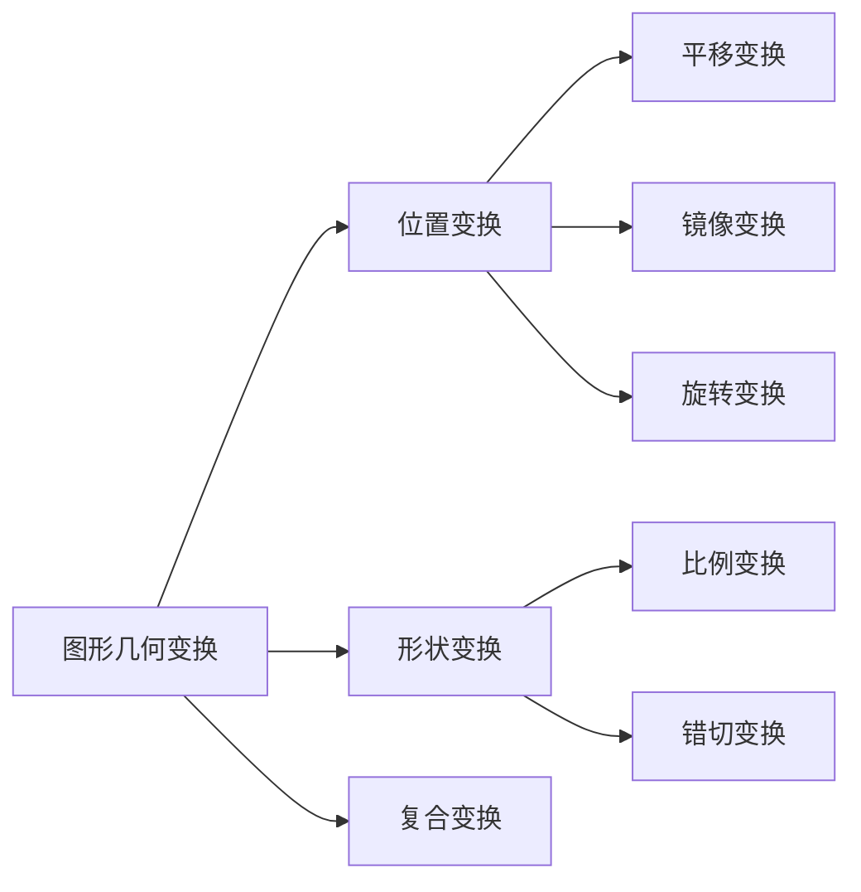

# 数字图像绪论
图是物体投射光或者反射光的分布，是客观存在的

像是人的视觉系统对图的接收在大脑中形成的印象或者认识，是人的感觉

图像是二者的结合


图像分类：
根据明暗程度与空间坐标的连续性可分为数字图像与模拟图像

- 模拟图像又称光学图像，空间坐标与明暗程度连续变化，计算机无法直接处理
    - 三维空间上连续
    - 时间连续
    - 波谱连续
    - 不可见的物理图像
    - 想象中的虚拟图像
- 数字图像：空间坐标与灰度均不连续，像素是最小单位
    - 一幅图像可以定义为一个二维函数f(x,y),x,y是空间坐标，f(x,y)称为图像在该点的幅值或灰度
    - 当x,y与f(x,y)均为离散数值时，称该图像为数字图像
    - 数字图像由有限个元素组成，每个元素称为像素
  


图像感知和获取的常用方法
- 电磁波辐射：电磁辐射辐射包括：无线电波（ m）、红外线（700nm-0.3mm）、可见光（430-790nm）、紫外线（10-400nm）、X射线(0.01 10nm)、 伽马射线（小于0.01nm）
- 声波
- 电子显微镜
- 荧光生物芯片
- 计算机合成


数字图像处理是借助于数字计算机来处理数字图像
数字图像处理的方式:
- 将一幅图像变为另一幅加过加工的图像，由图像->图像
- 对图像分析、识别与理解，将图像转化为非图像

数字图像处理的目的：
- 提高图像视感质量
- 提取图像中所包含的某些特征或者特殊信息
- 图像数据的变换、压缩与编码，便于图像存储与传输

数字图像处理的基本步骤:
1.图像获取
2.图像增强
3.图像修复，去噪
4.形态学处理（提取关键特征）
5.图像分割（将图像分割为不同区域）
6.图像展示
7.物体识别
图像压缩
彩图压缩

方法前提:
能够刻画对连续形式的图像进行离散化后的影响

寻求从模拟到数字、再由数字到模拟的转换过程中，保证我们感兴趣内容不丢失或者不明显损失的方法

能够预测到采样效应，并能采取有效措施消除它们的影响，或降低到可以容忍的地步

我们所处理的数字图像本质上等价于它所表示的连续图像

对一个物体的数字表示-二维矩阵-事假一系列的操作，已得到所期望的结果

图像文件格式:
图像的文件格式是计算机存储图像文件的方法，包括各种参数信息，不同的文件所包含的诸如分辨率、容量、压缩程度、颜色空间深度等都有很大不同

一般的文件结构包含有：
文件头、文件体、文件尾三部分

BMP：bitmap简写，windows中的标准图像文件格式，包含的图像信息较丰富，==几乎不进行压缩，占用空间大==，不支持alpha通道

PSD和PDD：photoshop软件的专用格式，保存文件较大

TIFF格式:标签图像格式，==无损压缩==，TIF格式==对于色彩通道图像来说是最有用的格式==，具有很强的
可移植性

GIF格式：用于网页中需要高速传输速率的图像文件，可以极大地节省存储空间

PDF：Adobe公司开发的电子文件格式，==与操作系统平台无关==

EPS：常用于矢量图与位图的转换

PNG:无损压缩，不支持动画应用效果

JPEG：压缩效率很高的存储格式，==有损压缩==，不支持alpha通道

RAW格式：记录了数码相机传感器的原始信息，也记录了由相机拍摄的一些原数据

FXG：一个基于XML的格式


# 第二章
视觉感知结构
视网膜上的感受器提供了图案视觉，感受器：锥状体与杆状体
虹膜的收缩与扩张控制着眼镜的通光量

锥状体数量在600-700万之间，位于视网膜的中间部分，称为中央凹，锥状体视觉称为白昼视觉或亮视觉

杆状体视觉称为暗视觉

视网膜图像主要聚集在中央凹区域，然后，光接收器的相对刺激作用产生感知，把辐射能转变为电脉冲，最后由大脑解码


人眼能够适应的光强度级别范围是很宽的，从暗阈值到强闪光约有$10^{10}$个数量级，主观亮度是进入人眼的光强的对数函数

亮视觉范围约为$10^6$，暗视觉范围约为$10^4$

## 图像的感知与获取

原理：
通过将输入电能和特殊类型检测能源敏感的传感器材料组合，把输入能源转变为电压，输出电压波形是传感器响应，通过把传感器响应数字化，从每一个传感器得到一个数字量。


### 使用单个传感器获取图像


底片安装在鼓上，鼓进行转动，引导螺杆进行平动，由于机械运动可以高精度的控制，所以这一方法是==得到高分辨率图像的一种廉价方法==
### 使用条带传感器获取图像


长方形状的传感器在一个方向上提供传感器单元，沿着与这个方向垂直的方向运动

环状传感器，大环内部为接收X光的传感器，X光源发射X光后，穿过物体内部，由传感器接收，物体沿着环的轴向运动，这样就可以将物体内部的结构进行成像了

### 使用传感器阵列获取图像

每个传感器的响应正比于投射到传感器表面的光能总量

通过将能量聚集到表面，已得到一幅完整的图像

几乎所有的城成像领域都可以得到应用

### 摄像器件性能
频谱响应性能：器件的分光灵敏度与相应波长的关系

辐射灵敏度:单位辐射通量输入到器件后所能产生的输出信号电流的大小

光电变换特性：输入辐射或光量发生变化时相应的输出信号电流的大小

暗电流：没有输入信息时器件输出的电流

分辨率：器件对图像细节的辨别能力

调制函数和方波振幅响应度：工程上更严格的表征器件分辨能力的方法

惰性：输入信息在强度发生变化时，输出信号的相应变化在时间上的滞后现象

动态范围：器件能处理的一帧景物内最亮单元与最暗单元亮度的比值，反映探测器能探测的最小信息与最大信息的能力，另一含义是最亮一帧与最暗一帧平均亮度的比值

### 图像形成模型


$f(x,y)=i(x,y)r(x,y)$

其中$0<i(x,y)<\infin,\\0<r(x,y)<1,\\i(x,y)表示入射到观察场景的光照辐射总量,r(x,y)$表示反射量占入射量的比例

令单色图像在任何坐标(x,y)处的强度表示为
$l=f(x_0,y_0)\\L_{min}<l<L_{max},\\L_{min}=i_{min}r_{min},\\L_{max}=i_{max}r_{max}$,
区间$[L_{min},L_{max}]$称为灰度级,通常令该区间为$[0,L-1],0为黑色，L-1为白色$

## 图像数字化


指的是将模拟图像经过离散化得到用数字表示的图像，包括了==空间离散化(即采样)==，和==明暗表示数据的离散化(即量化)==

数字图像的质量在很大程度上取决于采样与量化所用的样本数与灰度级

### 对坐标的数值化称为采样

上图中的(b)为AB线段上灰度的函数


==采样时尤其需要注意采样间隔的选取==

采样间隔太小会增大数据量，采样间隔太大会造成信息的混叠，导致细节无法辨认

#### 采样孔径
常用的有正方形、长方形、圆形与椭圆形


由于光学系统特性的影响，采样孔径会在一定程度上发生畸变，使边缘变得模糊，同时降低信噪比

#### 采样的方式
指采样间隔确定后，相邻像素之间的位置关系:有缝、无缝与重叠采样


当图像由单个传感单元与机械运动组合生成时，空间取样是选择机械增量或在取样处激活传感器来收集数据==理论上取样能达到的精细程度没有限制，但取样的限制由系统光学元件的质量等其他因素决定==

带状传感器的数量决定了图像在一个方向上的限制，但试图在另一个方向上实现超过被限制的取样密度是没有意义的

### 对幅值的数字化称为量化
量化所能达到的精度取决于离散级数和取样信号的噪声

### 图像数字化的处理规则

- 对于==缓变的图像==，应==细量化，粗采样==，以避免假轮廓
    这样就可以通过大块的像素来表示细节不丰富的图像
- 对==细节丰富的图像==，应==细采样，粗量化==
    这样就可以通过细微的像素来表示细节丰富的图像

- 要从采样样本中精确地复原图像，需满足图像采样的奈贵斯特定理：==空间分辨率必须小于或等于图像的最小周期的一半==，或==采样频率必须大于图像的最大频率的两倍==

- 数字化过程要求针对M N 离散灰度级数L作出判定，M N 必须取正整数，出于存储与量化硬件的考虑，灰度级数典型取为2的整数次幂，即$L=2^k$

### 数字图像表示
由一幅图像的坐标张成的实平面部分称为空间域，x,y是空间变量或坐标

三种基本方法表示f(x,y)


#### 函数图
&emsp; 难以表达细节丰富的图像
#### 灰度图
&emsp;允许快速观察结果
#### 矩阵或阵列
&emsp;用以处理和算法开发


### 一些术语
- 图像动态范围：图像中最大可度量灰度与最小可检测灰度之比，动态范围上限取决于饱和度，下限取决于噪声

- 饱和度：指超过这个值的灰度级将被剪切掉

- 噪声可掩盖可检测的最低真实灰度级
- 对比度：一幅图像中最高与最低灰度级之间的灰度差，高动态范围的图像具有高对比度，低动态范围的图像呆滞，看上去像是冲淡了灰度
- 一幅图像具有$2^k$个灰度级时，称该图像为k比特图像，储存该图像所需的比特数为$b=MNk$,常见的灰度级是0-255，换算成2进制就是$2^8$就是8比特图像，之所以用比特表示，是因为计算机使用二进制存储，如果在RGB图像中，单通道可能就已经达到8比特了

### 空间与灰度分辨率
区分图像中的目标物细节的程度，称为图像的分辨率。图像分辨率包括空间分辨率与幅度分辨率，分别由图像的采样与量化决定。

### 空间分辨率
空间分辨率是图像中可分辨的最小细节。

空间分辨率的度量:
- 每单位距离线对数
- 每单位距离点数(像素数)每英寸点数(dpi)

空间分辨率越大，图片效果越好

图像空间分辨率是由采样点数(N)决定的，当灰度级k一定时，采样点数越多，图像的空间分辨率越高，图像质量就越高，反之采样点数越少，空间分辨率就越低，图像质量越差，严重时会出现棋盘效应，这是因为像素块的面积增大所致。

==降低空间分辨率不一定导致图像大小变小，但是降低空间分辨率后图像的信息量降低了，此时为了节约空间，可以将图像变小==

### 灰度分辨率
灰度分辨率是灰度级中可分辨的最小变化。
保持像素数一定，灰度级减少时可能会出现伪轮廓，伪轮廓是类似于等高线的不连续过渡带


当灰度分辨率与空间分辨率同时减小时，也就是N(采样的点数)与K(灰度级)同时减小时，人对图片的主观感受可以用一条曲线表示，这就是等偏爱曲线。

从图中可以看出，当图片的细节较多时，只需要较少的灰度级。

==值得一提的是，等偏爱曲线是一个小组做了一个实验，让很多受测者根据主观感受选择图片，由此绘制的一幅曲线==

由Antti Lehmussola, Pekka Ruusuvuori and Olli Yli-Harja于2005年发表《[Exploring subjective image quality through isopreference curves]("E:\论文\iso perference curve.pdf")》于IEEE。

### 图像内插
内插使用已知数据估计未知位置的数值处理

最近邻内插法：把原图像中最近邻的灰度赋给每个新位置

双线性内插：$v(x,y)=ax+by+cxy+d$其中四个系数可由最邻近的未知方程确定

双三次内插：$v(x,y)=\displaystyle \sum^3_{i=0} \sum^3_{j=0}a_{ij}x^iy_j$16个系数可由最邻近点确定

相比之下，最近邻内插产生了最大的锯齿边缘，双线性内插得到了明显改进的结果，双三次内插产生了稍微清晰的结果

### 图像像素级运算
点运算
线性点运算
算术运算
加减乘除
逻辑运算
求反、异或、或、与

线性运算
对任意两幅f与g以及任意两个标量a和b,如果输入与输出均为图像，运算符H满足以下条件称其为线性运算
$H(af+bg)=aH(f)+bH(g)$

算术操作
$s(x,y)=f(x,y)+g(x,y)\\d(x,y)=f(x,y)-g(x,y)\\p(x,y)=f(x,y)*g(x,y)\\v(x,y)=f(x,y)/g(x,y)$

上述图像之间的算术运算可以理解为f和g中的相应像素对之间操作

==图像的算术运算涉及相同大小的图像==

==图像需要配准之后再进行算术运算==

图像相加可以平滑噪声，当多幅被加性噪声污染的图片中噪声不相关时，可以将多幅图片相加求均值进行去噪

图像相减可以增强差别，两幅图片相减可以表明它们的差别


图像相乘或想除可以校正阴影和进行模板操作
- 校正阴影
假如一个成像传感器可以产生由f(x,y)表示的完美图像与阴影函数h(x,y)的乘积来建模的图像，即g(x,y)=f(x,y)h(x,y)。如果h(x,y)已知，那么我们可以使用h(x,y)的倒数(即1/h(x,y))乘以感知图像的方法得到f(x,y)
    

- 模板操作
也称为感兴趣区域(ROI)操作，将模板与原图相乘获得凸显感兴趣区域的图片
    

#### 给定一幅图像，保证图像间算术操作的整个值域落入某个固定比特区间的方法:
$fm=f-min(f)\\得到最小值为0的一幅图像\\fs=K[fm/max(fm)]\\生成一幅标定的图像fs，值范围在[0,K]之间$

在处理8比特图像时，我们置K=255，就可以得到一幅灰度范围在0-255之间的全部8比特的满标度图像。

### 单像素操作
以灰度为基础改变单个像素的值，可以用一个变换函数来表示:S=T(z)，其中，z是原图像中像素的灰度，s是处理后图像中相应像素的灰度值

该图表现了任意输入值到对应输出值的变换(得到图像的负图像)


### 线性点运算
$I_{out}=I_{in}=a*I_{in}(x,y)+b\\1.a=1,b=0 : 恒等；\\
\\2、a<0: 黑白反转；
\\3、|a|>1: 增加对比度；
\\4、|a|<1: 减小对比度；
\\5、b>0: 增加亮度；
\\6、b<0: 减小亮度$


### 邻域操作
令 Sxy代表图像f 中以任意一点(x,y)为中心的一个邻域的坐标集。邻域处理在输出图像g中相同坐标处生成一个相应的像素，该像素的值由输入图像中坐标在Sxy内的像素经指定操作决定。

### 几何空间变换
由两个基本操作组成
- 坐标的空间变换
    $(x,y)=T{(v,w)}$
- 灰度的内插，即对空间变换后的像素赋灰度值

向前映射：扫描输入图像的像素，在(v,w)直接计算出(x,y),==但是这种方法可能导致多个点变换到同一位置，也有一些点变换后并不需要输出(超出图像区域)==

反向映射:扫描输出像素的位置，并在每个位置(x,y)使用$(v,w)=T^{-1}
(x,y)$计算输入图像中相应的位置，然后内插决定输出像素的灰度值


仿射变换:一种二维坐标到二维坐标的线性变换，保持二维图形的"平直性"(即变换后直线还是直线，圆弧还是圆弧)和平行性(二维图像间的相对位置关系不变)



### 位置变换
#### 平移变换
平移后的景物与原图像相同，但"画布"扩大了，否则会丢失信息。

平移后图像的每一点都可以在原图中找到对应点，若找不到，则直接设为0或255(找不到的点就是画布的点)
```matlab
I=imread('path');
I=double(I);
//相当于创建一个0矩阵用来放置结果
I_moveresult=zeros(size(I));
//获取I的维度
H=size(I);
Move_x=50;
Move_y=50;
//核心，将移动位置到边界赋值为原图中起始位置到边界位置减去移动坐标
I_moveresult(Move_x+1:H(1),Move_y+1:H(2))=I(1:H(1)-Move_x,1:H(2)-Move_y);
imshow(uint8(I_moveresult));
```
#### 镜像变换
- 图像的水平镜像是将图像沿水平中轴线为中心进行镜像对换
    
- 图像的垂直镜像操作是将图像的垂直方向的中轴线为中心进行镜像对换
    
- 图像的对角镜像是以图像中心进行镜像对换，相当于进行一次水平镜像和一次垂直镜像
    $\begin{cases}x=f_W-x_0\\y=f_H-y_0\end{cases}$
```matlab
I=imread('airplane.bmp');
I=double(I);
H=size(I);
I_flipud(1:H(1),1:H(2),1:H(3))=I(H(1):-1:1,1:H(2),1:H(3)); %垂直镜像
imshow(uint8(I_flipud));
figure;
I_fliplr(1:H(1),1:H(2),1:H(3))=I(1:H(1),H(2):-1:1,1:H(3)); %水平镜像
imshow(uint8(I_fliplr));
figure;
I_fliplr_flipud(1:H(1),1:H(2),1:H(3))=I(H(1):-1:1,H(2):-1:1,1:H(3));
%对角镜像
imshow(uint8(I_fliplr_flipud));
```
#### 旋转变换
旋转有一个绕着什么转的问题，通常是以图像的中心为圆心旋转，将图像上的所有像素都旋转一个相同的角度。和平移一样，旋转后，==画布也需要扩大==。


P绕O旋转到P',利用
$cos(a+\theta)=OP_y/L=cosacos\theta-sinasin\theta\\sin(a+\theta)=OP_x/L=sinacos\theta+sin\theta cos a\\令L=1,得到\begin{cases}x'=xcos\theta-ysin\theta\\ y'=xsin\theta+ycos\theta\end{cases}$

但是有一点需要注意，计算出的值为小数，而坐标值为正整数，所以需要进行==取整处理==。
- 画布的扩大
根据$\begin{cases}x'=xcos\theta-ysin\theta\\ y'=xsin\theta+ycos\theta\end{cases}$计算出x'、y'的最大与最小值，图像旋转后的画布大小即为$(x'_{max}-x'_{min},y'_{max}-y'_{min})$

- 图像像素坐标取整

由于计算得到的x'的范围发生变化，所以在新的坐标系中对其进行了移动(增大)，使得均为正数

上图中，取整时取距离该点最近的整数

- 图像旋转之后，又出现了新的问题
==出现问题的原因是因为像素之间的连接时不连续的==
    - 1.像素的排列不是按照原来的相邻关系
    
    相邻像素的角度是无法改变的，只能通过==增加分辨率来从整体上解决这个问题==
    - 2.出现了许多空洞点
        
        ==采用某种填补方法来填充空洞==

```matlab
I=imread('peppers.bmp');
I=double(I);
# 使用最邻近内插
I_rot30=imrotate(I,30,'nearest'); %旋转30度
# 使用双线性内插
I_rot30=imrotate(I,30,'bilinear');
imshow(uint8(I_rot30));
figure;
# 使用最邻近内插
I_rot45=imrotate(I,45,'nearest'); %旋转45度
imshow(uint8(I_rot45));
figure;
# 使用最邻近内插
I_rot60=imrotate(I,60,'nearest'); %旋转60度
imshow(uint8(I_rot60))
```
##### 填充方法
- 行插值
    
    1.找出当前行的最小和最大的非背景点的坐标$(i,k_1),(i,k_2)$
    2.在$(k_1,k_2)$范围内作插值，空点的像素值等于前一点的像素值
    3.同样的操作重复到所有行
- 列插值
同行插值，只是从列的角度进行的

经过插值之后，图像效果就变得自然了

### 图形形状变换
主要指图像的缩小、放大与错切

==图像的形状变换通常在目标物识别中使用==

#### 图像比例缩放变换
图像按比例缩放是指将给定的图像在x轴方向上按比例缩放$f_x$倍，在y轴方向缩放$f_y$倍


实现思路:
实际就是==对原有的多个数据进行挑选或者处理==，获得期望缩小尺寸的数据，并且尽可能保持原有的特征不丢失。

- 按比例缩小
    - ==最简单的方法就是等间隔地选取数据==
    1.原图为f(x,y),i=1,2,……,M  j=1,2,……N
    2.$G(x,y)=F(c_1*x,c_2*x)\\c_1=1/k_1,c_2=1/k_2$,
    - 总结一下就是，先利用缩小的倍数,计算出图像缩小后的大小,再将缩小后的各个像素除以缩小比例，反推到原图中对应的像素，然后从原图中取像素即可
    
    - ==基于局部均值的图像缩小方法==
    前面的缩小算法虽然非常简单，但是上面没有选到的点却无法反映在缩小后的图像中，为了解决这个问题，采用基于局部均值的方法来实现图像的缩小。

    1.首先计算出缩小的比例，计算出新图像的大小
    
    2.然后计算新图像中的像素对应的原图中参与贡献的像素位置
    
    3.对原原图中像素进行加和并求均值
    
- 不按比例缩小
#### 图像放大
直观地思索，貌似图像放大是图像缩小的逆操作，但实际却完全不一样，==因为图像缩小是从多个信息中选出需要的信息，而图像放大则是需要在空位中填入适当的值，是信息的估计==

由于图像的相邻像素之间的相关性很强，可以利用这个相关性来实现图像的放大。与图像的缩小相同，按比例放大不会引起图像的畸变，但不按比例放大会引起畸变。

一般采用==最近邻域法==与==线性插值法==。

- 最近邻域法
实现方法:
1.首先根据长、宽的放大倍数$K_1$与$K_2$确定新图像的大小
2.然后计算新图像中的像素对应原图的像素位置$G(x,y)=F(x/K_1,y/K_2)$


==但是，如果用这种方法放大倍数过大会出现马赛克效应==

- 线性插值法
为了提高几何变换后的图像质量，常采用线性插值法，原理是:当求出的分数地址与像素点不一致时，求出周围四个像素点的距离比，根据该比率，由四个邻域的像素灰度值进行线性插值。


计算公式:
$(1-q)\{(1-p)\times g([x],[y])+p\times g([x]+1,[y])\} +q\{(1-p)\times g([x],[y]+1)+p\times g([x]+1,[y]+1)\}$
简单来说，就是综合考虑两个方向，然后离得远的点乘以小比例，离得近的点乘以小比例。

```matlab
I=imread('splash512x512.bmp');
I=double(I);
I_enlarge=imresize(I,5,‘nearest’); %放大5 倍
I_enlarge=imresize(I,5,'bicubic');
imshow(uint8(I_enlarge));
I_reduce=imresize(I,0.5,‘nearest’); %缩小2倍
I_reduce=imresize(I,0.5,'bicubic');
figure;
imshow(uint8(I_reduce));
```

#### 图像的错切变换
图像的错切变换其实是平面景物在投影平面上的非垂直投影效果

因为绝大多数图像都是三维物体在二维平面上的投影得到的，所以需要研究图像的错切现象。

- 水平方向错切
$\begin{cases}x'=x+by\\
y'=y \end{cases}$

- 垂直方向错切
$\begin{cases}x'=x\\y'=y+dx
\end{cases}$


```matlab
I=imread("E:\大学生活\课堂需要\2022秋学期\数字图像处理\图像处理中的常用标准图像\lena.jpg");
I=double(I);
H=size(I);
B=zeros(H(1)+round(H(2)*tan(pi/6)),H(2),H(3));
for a=1:H(1)
for b=1:H(2)
B(a+round(b*tan(pi/6)),b,1:H(3))=I(a,b,1:H(3));
end
end
imshow(uint8(B))

```

在编写代码的时候，有一点==直觉上容易犯的错误==，比如说，我们在进行垂直错切时，==像素点的y值应该被拉伸，但是y值对应的应该是矩阵中的行索引==。

图像的复合变换

是指对图像连续施行==若干次==的平移、镜像、比例放缩、旋转等==基本变换==后完成的变换。

图像的复合变换又称为==级联变换==

复合变换的类型包括两种:
1.同一种基本变换依次连续进行若干次
2.包含有不同的基本变换

复合平移
连续平移
可以先合成最终的平移矩阵，然后再处理变量

复合缩放
连续缩放

复合旋转
对某个图像连续旋转

如果要对某一个参考点作变换，则要使用含有不同种基本变换的图像复合变换

不同的复合变换其变换过程不同，但是无论变换过程多么复杂，都可以分解为基本变换

IPT利用一个所谓的tform结构来表示空间变换，创建这种结构的函数是
```matlab
tform=maketform(transform_type,transform_parameters)
```
创建仿射变换的一种途径就是直接提供矩阵T

IPT函数imtransform使用反向映射，反向映射的过程按输出像素计算出输入像素位置，利用输入像素采用插值决定输出像素。

```matlab
g=imtransform(f,tform,insterp)
```
interp是一个字符串，用来指明怎样插值来获得输出像素

### 图像配准
图像配准==用于对齐两幅或多幅相同场景的图像==，在图像配准时，我们已知输入图像与输出图像，

输入图像：希望变换的图像

参考图像：想要配准输入图像的图像

用双线性插值等插值方法建模，通过控制点求解模型中具体的参数

控制点的多少与模型的复杂程度取决于几何畸变的严重程度

距离：
描述图像中两个像素点之间的距离
- 欧几里得距离(Euclidean distance)
    $D((i,j),(h,k))=\sqrt{(i-h)^2+(j-k)^2}$
- 曼哈顿距离
    D((i,j),(h,k))=|i-h|+|j-k|
- 棋盘距离
    D((i,j),(h,k))=max{|i-h|,|j-k|}

### 像素的邻域
描述与像素相邻的其他像素
4邻域与8邻域


### 图像变换
#### 一般方法
$输入图像\stackrel{经过变换}{\rightarrow} 变换域\stackrel{在变换域处理}\to处理后的图像\stackrel{反变换}\to得到空间域的处理后的图像$

#### 向量与矩阵操作

n幅分量图像将形成n维向量，一旦像素被表示为向量，我们可以使用向量矩阵这一工具。
像素向量线性变换
$W=A(z-a)$

A为$m\times n$的矩阵，z和a是$n\times 1$的列向量

整个图像表示成矩阵在解决大量数字图像处理问题时有重要意义
#### 概率方法
以随机量处理灰度，令$z_i$表示一幅图像可能的灰度值，则$p(z_k)=\frac{n_k}{MN}n_k为z_k出现的次数，MN为像素总数$

$平均灰度:m=\sum_{k=0}^{l-1}z_kp(z_k)\\方差:\sigma^2=\sum_{k=0}^{l-1}(z_k-m)^2p(z_k)$

方差是图像对比度的有用度量

在开发图像处理算法中，概率的概念起着核心角色的作用:推导灰度变换算法、开发图像复原算法等

## 灰度变换与空间滤波
图像的动态范围:图像中最大可度量灰度与最小可检测灰度之比

对比度:一幅图像中最高和最低灰度级之间的灰度差

图像增强采用一系列技术取改善图像的视觉效果，或将图像换成一种更适合于人或机器进行分析和处理的形式。

例如采用一系列技术有选择地突出某些感兴趣的信息，抑制一些不重要的信息，提高图像的使用价值。

==图像增强方法从增强的作用域出发，可分为空间域增强与频率域增强==

- 空间域增强是直接对图像各像素进行处理
- 频率域增强是将图像经傅里叶变换后的频谱成分进行处理，然后逆傅里叶变换获得所需图像

==空间域增强操作主要分为灰度变换与空间滤波两类==

灰度变换在图像的单个像素上操作，以对比度与阈值处理为目的。

空间滤波涉及改善性能的操作，如通过图像中每个像素的邻域处理来锐化图像

空间域的处理可用下式表示:
$g(x,y)=T(f(x,y))\\其中f(x,y)为输入图像,g(x,y)为处理后的图像,T为(x,y)的邻域上定义的关于f的一种算子$

算子(核/模板)在图像上滑动，计算出图像处理后的值，得到处理后的图像，这一过程称为空间滤波。

邻域与预定义的操作一起称为空间滤波器(空间掩模、核、模板或窗口)

$s=T(r)\\s为算子处理后的灰度，r为处理前也就是输入的灰度$

灰度变换可以使图像:
- 动态范围加大
- 对比度扩展
- 图像更加清晰
- 特征更加明显
灰度变换其实就是按一定的规则修改图像每一个像素的灰度，从而改变图像灰度的动态范围

### 一些基本的变换函数
#### 线性函数(反转变换域恒等变换)
- 反转变换由下式给出:
$S=L-1-r$


    反转可以得到等效的照片底片，反转并不能改变图像内容，只是分析起来更方便

- 线性灰度变换
输入图像灰度范围为$[a,b]$
输出图像灰度范围为$[c,d]$

    $\begin{cases}d~~~f(x,y)>b\\\frac{d-c}{b-a}[f(x,y)-a]+c~~~a\leq f(x,y)\neq b\\ c~~~f(x,y)<a \end{cases}$

    

- 分段式线性灰度变换
为了突出图像中感兴趣的目标或者灰度区间，将==图像灰度区间分成两段乃至多段分别作线性变换==称之为分段线性变换。

    优点:形式上可以处理任意复杂的问题
    缺点:要求用户输入较多参数
- 其他线性灰度变换
    

- 分两段的线性变换
    暗区扩展亮区压缩
    


    暗区压缩亮区扩展


### 非线性动态范围调整
由于线性动态范围调整的分段线性影映射不够光滑

非线性动态范围调整，要求可以用光滑的曲线来实现

#### 对数变换
有一个近似对数算子的环节，==可以采用对数运算来实现非线性动态范围调整==

$s=clog(1+r)$,c为常数,并且假设$r\geq0,之所以是1+r是为了令变换从坐标原点开始$,==该变换可以扩展暗像素的值，压缩更高灰度级的值，反对数变换作用相反==

#### 幂律变换(伽马变换)
幂律函数(n次幂和n次根变换)
$s=cr^\gamma\\c与\gamma均为正常数\\\gamma<1时,提高灰度级,在正比函数上方,使图像变亮\\\gamma>1时,降低灰度级,在正比函数下方,使图像变暗$


伽马校正
由于显示系统或采像设备存在的硬件特性指数Gamma(>1)会使其输出较原始图像产生非线性失真，失真程度由具体系统的Gamma值决定。

所以为了使显示设备的输出亮度或采像设备采集到的亮度真实，我们可以对原始图像先进行一次预补偿，即==让原始真实图像产生与硬件特性指数相反的反向失真==


如下图所示，将产生反向失真后的图像再输出到显示系统显示则可以达到线性输出的目的，这一过程称为Gamma校正。


### 灰度级分层
突出图像中特定灰度级范围，而保持其他灰度级不变或者降低


### 灰度直方图
含义:灰度直方图是表达灰度分布情况的统计图像

直方图是图像的重要统计特征,是图像灰度密度函数的近似,它表示图像中具有某种灰度级的像素的个数,反映了图像中每种灰度出现的频率。

未量化前(灰度连续变化的情况):横轴为灰度值r，纵轴为出现r的概率密度p(r)

量化后(灰度离散的情况):横轴为离散的灰度值k,纵轴为出现此灰度值的概率P(k)

直方图可以表示不同灰度的占比，但不能反映任何空间位置方面的信息


灰度级范围为[0,L-1]的数字图像的直方图是离散函数$h(r_k)=n_k$,其中$r_k$是第k级灰度,$n_k$是图像中灰度为$r_k$的像素个数。

归一化直方图:用$n_k/MN$作为函数值

直方图是多种空间域处理技术的基础(如压缩与分割),通过修改直方图增强图像是一种实用而有效地方法。

灰度直方图的计算示例


### 四种基本的图像类型:
暗图像：直方图的分量集中在灰度级的低端

亮图像：直方图的分量集中在灰度级的高端

低对比度图像：低对比度图像具有较窄的直方图,且集中在灰度级的中部

高对比度图像:灰度分布均匀


### 直方图均衡化
#### 定义:
==直方图均衡化是将原图像通过某种变换,得到一幅灰度直方图为均匀分布的新图像的方法==

#### 数学表示为:
$r与s为归一化后的原图像与经直方图修正后的图像灰度,即0\leq r,s\leq 1$

在[0,1]区间内的任何一个r值，都可产生一个s值,且$s=T(r)$

$T (r) $作为变换函数，需要满足:
- 1.在$0\leq r\leq1$中为单调递增函数,这是为了保证从黑到白的次序不变
- 2.在$0\leq r\leq1$中，有$0\leq T(r)\leq 1$，确保映射后的像素灰度在允许的范围内

==反变换关系==为:$r=T^{-1}(s)$,如果要存在反变换关系则需要==多满足一个条件==:$T(r)$在[0,1]内严格单调递增，这是为了使反变换时一个x对应一个y，构成函数，而不至于一个x对应多个y，出现二义性


#### 数学角度看待:
- 下图左是原图，灰度级数分布非常不均匀，我们想要获得如下图右所示的均匀灰度级分布

- 我们基于一条概率论中的重要结论:
==变换后的变量s与原变量的关系为==:
$p_s(s)=p_r(r)\frac{dr}{ds}~~~(1)$

  - 推导:
由概率论的基本结论:
$设\xi是连续型随机变量,其概率密度函数为p(x)，又函数y=f(x)严格单调，其反函数h(y)有连续导数,则\eta=f(\xi)也是一个随机变量，其概率密度函数为\\\varphi=\begin{cases}p[h(y)]\times|h'(y)|~~\alpha<y<\beta\\0,其他\end{cases},\\其中\alpha=min\{f(-\infin),f(+\infin)\}\\\beta=max\{f(-\infin),f(+\infin)\}$
改结论的证明见(https://blog.csdn.net/qq_38109282/article/details/109206782)

- ==之后，假设变换函数为==:
$s=T(r)=(L-1)\int^r_0p_r(w)dw~~~(2)$

- 根据莱布尼茨公式知,定积分关于上限的导数是在上限处计算的积分,也即:
$\frac{d}{dr}[\int_0^{L-1}p_r(w)dw]=p_r(r)~~~(3)$
再利用上述(2)(3)即可得到下面的关系:
$\frac{ds}{dr}=\frac{dT(r)}{dr}=(L-1)\frac{d}{dr}[\int_0^{L-1}p_r(w)dw]=(L-1)p_r(r)~~~(4)$
再将(4)代入(1)，得
$p_s(s)=p_r(r)\frac{1}{(L-1)p_r(r)}=L-1$

- ==由此，之前假设的变换函数即为我们要找的变换函数==

### 在离散灰度级中
灰度出现的概率近似为:$p_r(r_k)=\frac{n_k}{MN}$

变换函数的离散形式为:
$s_k=T(r_k)=(L-1)\sum^k_{j=0}p_r(r_j)=\frac{(L-1)}{MN}\sum_{j=0}^kn_j$

变换函数称为直方图均衡或直方图线性变换

在这里累积分布变换函数的意义是:
每当$r_k$增加1时，$s_k$才会进行一次变化
值得一提的是，这里有8个灰度级，只是这里没有乘上L-1，并不影响图形的形状

利用累积分布函数作为灰度变换函数，经变换后得到的新灰度的直方图虽然不平坦，但是比原图像平坦得多，动态范围也扩展了。

变换的灰度级减少了，这种现象叫做简并现象。这是像素灰度有限的必然结果。

直方图均衡化重复做就没有意义了，不能严格均匀，灰度级会发生简并。

### 直方图匹配(规定化)
直方图规定化是使原图像灰度直方图变成规定形状的直方图而对图像修正的增强方法，也称为直方图匹配。

==直方图均衡化是直方图规定化的一个特例。== 一般来说，正确选择规定化的函数可以获得比直方图均衡化更好的效果。

==直方图规定化的步骤==:
1.首先对原图进行直方图均衡化
该图为原图，未画出均衡化后图像

2.然后对需要匹配的目标图像进行直方图均衡化
该图为要匹配的目标图

该图为要匹配的图均衡化后的灰度图与反变换

3.然后对原图均衡化后的图像执行匹配图像均衡化的变换函数的反函数

4.得到匹配后的图像


数学原理:
已知:
任何一幅图进行直方图均衡化的变换函数均为$s=(L-1)\int^r_{k=0}p_r(r_k)$
对于原图和匹配的目标图来讲都是如此，它们均衡化后的结果均是概率密度为$\frac{1}{L-1}$的灰度图(当然，实际并不能严格处理,但是理论上是如此，这里的误差在于灰度级数为离散值)，所以将原图均衡化后再乘以匹配图的反变换就可以得到匹配图(近似)


### 局部直方图处理
因为直接对直方图整体进行均衡化或者规定化区域比较大，会将整幅图的灰度都进行均衡，但是对于一幅图来说不同的区域的处理需求可能不同，所以局部的直方图均衡化效果更好。

### 空间滤波基础
依据邻域元素一起确定元素值
==卷积==数学原理:$\\连续形式(f*g)(t):\int_{-\infin}^{+\infin}f(x)g(t-x)dx\\离散形式:(a*b)_n=\sum_{i,j~i+j=n}a_ib_j$
==卷积其实就是两组数，一组进行反转，然后逐点相乘==

相关与卷积的关系其实就是核是否发生翻转,卷积发生翻转是因为数学形式上的一种定义。

卷积时，核刚开始会超出图像，此时需要为图像外层扩充0使得核能够与图像对齐，之后会形成超出原图像大小的卷积图像，裁剪与否根据具体情况决定。

单位离散冲激函数是一个中间数字为1，其余为0的函数，卷积核与这样的函数卷积后，会使卷积核发生翻转。

空域滤波是在图像空间上借助模板进行邻域操作完成的，空域滤波按线性与非线性特点有:
1.基于傅里叶变换分析的==线型滤波器==
2.直接对邻域进行操作的==非线型滤波器==
空域滤波按照功能分为==平滑滤波==与==锐化滤波==


### 平滑空间滤波器
平滑滤波可以用低通滤波实现
平滑的目的:
1.消除噪声
2.去除太小的细节或者将目标内的小间断连接起来实现模糊

平滑空间滤波器的常见分类:
- 线性滤波器:均值滤波器
- 非线性滤波器:
    - 最大值滤波器
    - 中值滤波器
    - 最小值滤波器

### ==均值滤波器==
最简单的就是取平均值，可以加权平均也可以普通平均，==需要归一化==。

不同大小的模板/核处理相同的图像会产生不同的效果。

在上图中从左上到右下依次使用了不同大小的模板，不难发现，当模板较大时，会使得图像发生模糊现象。

==模糊产生的原因==:这是因为，处理后的图像中一点的元素是由于原图中邻域的元素作用而成的，灰度值会平均，周围浅色变得更深，深色变得更浅，特征便变得模糊，而小模板处理的邻域较小，灰度值较为接近，所以没有产生这样的效果。

对特定的问题，我们会使用合适大小的模板。
均值模板的应用，处理一些微小的细节，使其模糊化消失(模糊到与周围灰度值相同)，然后再用阈值函数处理。达到突出大的特征，清楚小特征的效果。


均值滤波器的特点：
- 1.求均值其实是一个是均方误差最小化的过程
    推导:
    $min~~\sum_i(a-a_i)^2\\ (\sum_i(a-a_i)^2)'=0\\(a-a_1)+(a-a_2)+……+(a-a_n)=0\\n*a=(a_1+a_2+……+a_n)\\a=\overline a_i$
- 2.像素值与热量有类似的地方，求像素的局部均值就是在扩散像素值，使得方差增大的过程
    - $p(x,y,\sigma)=F(x,y)*G(0,\sigma)$
    $\frac{df}{dt}=\nabla f=\frac{d^2f}{dx^2}+\frac{d^2f}{dy^2}$
    这两式是共通的

总结一下，==作用==:
- 减小噪声
- 去除一些比较小的目标物
- 减小图像的尖锐变化

==问题==:可能会导致边缘发生模糊

==解决边缘模糊的方法==：
- 1.用不同的局部运算代替整体的局部平均
- 2.非局部均值运算，比如中值滤波器
### ==统计排序滤波器==
一种==非线性滤波器==
常见分类:
- 中值滤波器
- 最大值滤波器
- 最小值滤波器

中值滤波器的数学原理:
$min~~\sum_i|a-a_i|$
取邻域中的中值元素相当于求$|a-a_i|$的累积最小值，推导未给出
中值滤波器的优点:
- 1.在去除噪声的同时，可以比较好的保留边的锐度和图像的细节(优于均值滤波器)
- 2.能有效去除椒盐噪声

    
    一个加以随机噪声的同一像素相加取平均可以去除噪声，以此为灵感，找一些图像中相似的结构进行相加取均值，也可以达到类似的效果$\to$再进行推广，不同的结构采用非均值的其他方法也可以达到效果
### ==锐化空间滤波器==
用途:
- 突出图像中的细节，增强被模糊的细节
- 印刷中的细微层次强调
- 图像分割前的边缘提取
- 锐化处理恢复过度钝化、曝光不足的图像

数学原理:
均值产生了钝化的效果，均值类似于积分再除以总量，那么微分相当于积分的反操作，也就是说微分能产生锐化的效果

二阶微分滤波器-拉普拉斯算子

一阶微分滤波器-梯度算子

### ==拉普拉斯算子==

数学原理,图像求二阶导近似为：
$\frac{\partial^2 f}{\partial x^2} \approx f(x+1)+f(x-1)-2f(x)$
所以拉普拉斯算子为
$\left[\begin{matrix}0&1&0\\1&-4&1\\0&1&0 \end{matrix}\right]$
还有许多其他变体

拉普拉斯变换对图像增强的基本方法:
$g(x,y)=\begin{cases}f(x,y)-\nabla^2f(x,y)\\f(x,y)+\nabla^2f(x,y)\end{cases}$
两者的不同在于第一种是抑制中心像素，增强周围像素来增强差异来达到锐化效果

第二种是增强中心像素，抑制周围像素，来增强差异达到锐化效果

### ==梯度算子==
就是相当于求解邻域中央位置元素的梯度
数学原理:
数字图像求梯度近似为
$\frac{\partial f}{\partial x} \approx f(x+1)-f(x)$

所以梯度算子为
$\left[\begin{matrix}0&0&0\\0&-1&1\\0&0&0 \end{matrix}\right]$
### 其他微分滤波器模板

Roberts交叉梯度算子

Prewitt梯度算子

Sobel梯度算子


### 非锐化掩模(unsharp masking)
首先平滑图像，削弱边界


然后用原图减去削弱后的图像，得到边界

之后将边界加至原图，达到增强边界的效果


#### 线性系统
系统的定义:
接收一个输入，并==产生一个相应输出==的任何实体，系统的输入是一个或两个变量的函数，==输出是相同变量的另一个函数==。

线性系统的定义:
对于某特定系统，有:
$x_1(t)\to y_1(t)\\x_2(t)\to y_2(t)$
==该系统是线性的==当且仅当$x_1(t)+x_2(t)\to y_1(t)+y_2(t)$

从而有$a\times x_1(t)\to a\times y_1(t)$

线性系统的==移不变性==:
对于某线性系统，有:
$x(t)\to y(t)$
当输入信号沿时间轴平移T，有:
$x(t-T)\to y(t-T)$


若函数集合$U=\{u_0(t),u_1(t),……\}$满足$\int_{t_0}^{t_0+T}u_m(t)u_n(t)dt=\begin{cases}C~~ m=n\\0~~其他 \end{cases}$
则该函数集合为正交函数集合

另外，当C=1时，集合为归一化正交函数集合，即每个向量为单位向量

物理意义为:多维空间坐标的基轴方向互相正交

==正交变换与酉变换的关系==:
- 正交变换是酉变换的特例
- 它们都可以用作信号分析
- 用于信号分析的基函数集合与正交矩阵都应满足正交性与完备性(因为傅里叶计数其实就是由正交函数集合表示的)

==傅里叶级数==表示:
$f_T(t)=\frac{a_0}{2}+\sum_{n=1}^\infin(a_ncosnwt+b_nsinwt)$

复指数形式为：
$f_T(t)=\sum_{n=-\infin}^\infin c_ne^{-jnwt}dt\\c_n=\frac{1}{T}\int_\frac{-T}{2}^\frac{T}{2}f_T(t)e^{-jnwt}dt$


==傅里叶变换==的数学形式:
$F(w)=\int f(x)e^{-iwx}dx\\其中,e^{-iwx}=cos(wx)-isin(wx)$

其实傅里叶变换的形式就是幅度随时间的变化的函数f(x)与组成波的频率为w的部分波的幅度的乘积的积分。

虚部是为了控制相位变化。

F(w)表示了频率为w的波与输入的波之间的相关性，如果相关性大于0则说明该频率的波是组成波的一部分，归一化后即可得到其组成。

==冲激函数==
冲激函数(Impulse Function)的数学定义
$δ(t)=\begin{cases}\infin~ t=0\\0~ t\neq0\end{cases} 
$
表示在某一时刻有一个近乎无限大，而在其他时刻什么都没有的函数
它的积分还有如下性质:
$\int\delta(t)dt=1$

==对信号的采样==

利用冲激函数的特点，我们进行图像的采样:
$\int f(t)\delta(t)dt=f(0)$
可以进一步推广到在任意时刻取样
$\int f(t)\delta(t-t_0)dt=f(t_0)$

离散形式的冲激函数及其"积分":
$δ(t)=\begin{cases}1~ t=0\\0~ t\neq0\end{cases} 
$\sum \delta(t)=1$
$\sum f(t)\delta(t-t_0)=f(t_0)$

在图像采样时布置很多冲激函数，称为冲激串


带限函数:区间[a,b]之外为0的傅里叶变换为0

取样定理
又称奈奎斯特定理，规定:对于连续信号进行采样时，抽样信号的最小频率p(t)要大于信号最大频率的两倍，才能还原原始信号

时域卷积相当于频域相乘

频域相乘相当于时域卷积

采样频率大于奈奎斯特取样率，信号频谱每一次卷积平移后会发生相互交叠

采样频率小于奈奎斯特取样率，会发生周期重叠，会发生欠采样，或者混淆

拥有限长度进行取样与记录工作，混淆是一个不可避免的事实，可以通过平滑输入函数减少高频分量的方法来降低混淆的影响，称为==抗混淆==。必须在取样前完成，因为混淆是一个取样问题，所以不能使用'事后消除'

混淆包括两种:
- 空间混淆
    欠采样造成的，属于人为引入的缺陷
- 时间混淆
    与图像序列中图像间的时间间隔有关
    最常见的是轮子效应，在序列图像中出现车轮倒转的现象

当处理具有很强的边缘内容的图像时，混淆的影响看起来就像是块状图像分量，称为锯齿


傅里叶变换的性质:
- 傅里叶变换的频率谱是对称的
- 平移性：对图像的平移不影响傅里叶变换的幅值
- 旋转性，将空域中的图像旋转，频域中的频谱也旋转同样的角度
- 周期性：只需在一个周期里的变换就可以将F(u,v)就可以把频域里的确定
- 共轭对称性：两个复数实部相等，虚部互为相反数时，这两个复数叫共轭复数
- 分离性：二维的傅里叶变换可以分离为对图像一行一行进行，再对中间结果一列一列进行

- 平均值:若处理的是图像，在原点的傅里叶变换即等于图像的平均灰度级
- 卷积理论：
    
    在空域的卷积相当于在频域形式的相乘
- 相关性理论：
    
    共轭的相关相当于另一域的共轭与另一函数的相乘

卷积与相关性理论总结:
- 卷积时空间域过滤和频率过滤之间的纽带

- 相关的重要应用在于匹配，确定是否有感兴趣的物体区域
        

### ==快速傅里叶变换(FFT)==
根据傅里叶变换的分离性可知，二维傅里叶变换可由连续两次一维傅里叶变换得到

离散傅里叶变换已经成为数字信号处理的重要工具
但是它的计算量较大，运算时间长，限制了适用范围，快速算法大大提高了它的运算速度

==快速傅里叶变换并不是一种新的变换，只是离散傅里叶变换的一种算法==，消除了一些多余运算，大大节省了工作量


快速傅里叶变换的思想:
- 1.通过计算两个单点的DFT,来计算两个点的DFT
- 2.通过计算两个双点的DFT,来计算四个点的DFT,以此类推
- 3.对于任何$N=2^m$的DFT的计算，计算两个N/2的DFT,来计算N个点的DFT

在蝶式流程图中，把具有相同来源的一对节点称为对偶节点

### 频域处理主要内容
为什么要在频率域研究图像增强
- 一些在空间域表述困难的增强任务，在频率域变得非常普通
- 滤波在频率域更为直观，它可以解释空间滤波的某些性质
- 可以在频率域指定滤波器做反变换，然后在空间域使用滤波器进行计算
- 一旦频率域实验选择了空间滤波，通常都是在空间域进行的

傅里叶变换的频率分量与图像空间特征之间的联系:
- 当从变换的原点移开时，低频对应着图像的慢变化分量，如图像的平滑部分
- 进一步离开原点时，较高的频率对应着图像中变化越来越快的灰度级，如边缘或噪声等尖锐的部分

频域滤波增强原理:
空间图像增强基础理论-线性系统滤波
$g(x,y)=h(x,y)*f(x,y)$
由傅里叶变换中的卷积定理，上述线性系统可模型化为
$G(u,v)=H(u,v)F(u,v)$

==F(u,v)==-待增强图像f(x,y)的傅里叶变换，定义了待增强图像f(x,y)分解为一系列基图像后的加权系数

==H(u,v)==-对应于空域线性系统冲激函数的傅里叶变换，称之为传递函数或滤波器函数

==通过H(u,v)对f(x,y)分解为基图像后加权系数的修改，从而实现图像的增强-图像的频域滤波增强==

理论上，任何变换只要具有正交性和完备性，都可以定义类似的运算方式，但只有傅里叶变换具有严格的卷积定理证明

在傅里叶变换域，变换系数反映了图像在空域难以定义的某些特征:
- 频域的直流低频分量对应于图像的平滑区域
- 频谱的高频分量对应于图像的边沿或变化剧烈区域
- 外界叠加噪声对应于频谱中频率较高的部分
- 恒定的干扰条纹对应于频谱中的某些特征点

==构造一个滤波器，刻意地提升某些频率分量，压低或去除另一些分量，从而达到图像增强的目的==

空域滤波基本上借助于模板运算实现，难于实现真正意义上的线性系统滤波

==在实际应用中空域滤波的尺寸难以扩大，使滤波增强所需信息局限在较小的局部区域==，难以获得更为理想的结果和处理较为复杂的杂波去除，多特征增强等

频域滤波的滤波步骤：
- 1.用$(-1)^{x+y}$乘以输入图像进行中心变换
$f(x,y)(-1)^{x+y}\leftrightarrow F(\frac{(u-M)}{2},\frac{(v-N)}{2})$
- 2.计算1中的DFT F(u,v)
- 3.用滤波器函数H(u,v)乘以F(u,v)
- 4.计算3中结果的反DFT
- 5.得到4中结果的实部
- 6.用$(-1)^{x+y}$乘以5中的结果，取消输入图像的乘数
    
频率域滤波G(u,v)=H(u,v)F(u,v)
相乘在逐元素上定义，即H的第一个元素乘以F的第一个元素，H的第二个元素乘以F的第二个元素

一般，F的元素为复数，H的元素为实数

H为零相移滤波器，因为滤波器不改变变换的相位，F中的实部与虚部的乘数（H）可以抵消相角$\phi(u,v)=arctan[\frac{I(u,v)}{R(u,v)}]$


### 一些基本的滤波器
### 陷波滤波器
$H(u,v)=\begin{cases}0~ (u,v)=(\frac{M}{2},\frac{N}{2})\\1~ 其他\end{cases}$
- 设置F(0,0)=0（结果图像的平均值为0，而保留其他傅里叶变换的频率不变）
- 除了原点处有凹陷外，其他均是常量函数
- 由于图像平均值为0而导致整体平均灰度级而降低
- 用于识别由特定的、局部化频域成分引起的空间图像效果


### 低通滤波器/平滑滤波器
使低频通过而使高频衰减的滤波器
- 被低通滤波的图像比原始图像少尖锐的细节部分而突出平滑过度部分
- 对比空间域滤波的平滑处理，如均值滤波器
### 高通滤波器/锐化滤波器
- 被高通滤波的图像比原始图像少了灰度级的平滑过渡而突出边缘等细节部分
- 对比空间域的梯度算子，拉普拉斯算子


高通滤波改进，为滤波器加上一个常数


### 卷积定理
$f(x,y)*g(x,y)\leftrightarrow F(u,v)H(u,v)$
- 上式说明空间域卷积可以通过F(u,v)H(u,v)的乘积进行反傅里叶变换得到
$f(x,y)h(x,y)\leftrightarrow F(u,v)*H(u,v)$
- 说明空间域乘法可以通过频率域的卷积得到
- 上述两个公式主要为两个函数逐元素相乘的乘法

==空间域和频率域中的滤波器组成了傅里叶变换对==

==给出在频率域的滤波器，可以通过反傅里叶变换得到在空间域对应的滤波器，反之亦然==

==滤波在频率域更为直观，但在空间域使用更小的滤波器模板==

==可以在频率域指定滤波器，做反变换，然后在空间域使用结果滤波器作为在空间与构建小滤波器模板的指导==

高斯频率域低通滤波器函数:
$H(u)=Ae^{\frac{-u^2}{2\sigma^2}}$
空间域高斯低通滤波器:
$h(x)=\sqrt{2\pi}\sigma Ae^{-2\pi^2\sigma^2x^2}$

高斯高通滤波器函数:
$H(u)=Ae^{\frac{-u^2}{2\sigma_1^2}}-Be^{\frac{-u^2}{2\sigma_2^2}}$
空间域高斯高通滤波器为:
$h(x)=\sqrt{2\pi}\sigma Ae^{-2\pi^2\sigma_1^2x^2}-\sqrt{2\pi^2\sigma_2^2x^2}$


==低通滤波器重要结论==
- 当H(u)有很宽的轮廓时(大的$\sigma$值),h(x)有很窄的轮廓，反之亦然，当$\sigma$接近无限，H(u)趋于常量函数，而h(x)接近冲激函数
- 两个低通滤波器的相似之处在于两个域的值均为正数，所以使用空间域的模板数时，都为正数
- 频率域低通滤波器越窄，滤除的高频部分就越多，使得图像就越模糊，在空间域，这意味着模板越大

==高通滤波器重要结论==
- 空间域滤波器有正值也有负值，一旦值变为负值，就再也不会变成正数
- 频率域可以凭直观指定滤波器
- 空间域滤波效果取决于空间模板的大小

频率域平滑滤波器
- 理想低通滤波器
- 巴特沃斯低通滤波器
- 高斯低通滤波器

- 边缘和噪声等尖锐变化处于傅里叶变换的高频部分
- 平滑可以通过衰减高频部分的范围来实现
- 理想低通滤波器:尖锐
- 巴特沃斯低通滤波器:处于理想和高斯滤波器之间
- 高斯低通滤波器:平滑

理想低通滤波器
截断傅里叶变换中的所有高频部分，这些高频成分处于指定距离$D_0$之外


==圆形低通滤波器作用==：
- $D_0半径内频率分量无损通过$
- 圆外的频率分量会被滤除
- 若滤除的高频分量中含有大量的边缘信息，会发生图像边缘模糊现象

理想低通滤波器分析:
- 整个能量的90%被一个半径为8的小圆周包含，大部分尖锐的细节信息都存在于被去掉的10%能量
- 小的边界和其他尖锐细节信息被包含在频谱的至多0.5%的能量中
- ==被平滑的图像被一种非常严重的振铃效果-理想低通滤波器的一种特性所影响==

巴特沃斯低通滤波器：
不会出现振铃效应，没有明显的截断，这是滤波器在低频与高频之间平滑过度的结果


与理想低通滤波器相比:
- 没有明显的阶跃
- 模糊程度减少
- 尾部含有较多的高频，对噪声平滑效果不如理想低通

高斯低通滤波器
- 不能达到有相同截止频率的二阶巴特沃斯的效果
- 没有振铃效应
- 如果需要严格空值低频到高频的过度，选用巴特沃斯可能会产生振铃

应用实例:
- 处理卫星和航空图像
- 字符识别
- 印刷与出版业

频率域锐化滤波器
- 理想高通滤波器
    截断傅里叶变换中的所有低频部分
- 巴特沃斯滤波器
- 高斯高通滤波器
- 频率域的拉普拉斯算子
- 钝化模板、高频提升滤波和高频加强滤波
    为什么要进行高频提升和高频加强
    - 高频滤波后的图像背景平均强度减小到接近黑色(因为高通滤波器滤除了傅里叶变换的零频率部分)
    - 解决办法:把原始图像加到滤波后的结果，称为高频提升过滤

- 钝化模板(锐化或高通图像):一幅图像减去其自身模糊图像而生成的锐化图像，在频率域，即从图像本身减去低通滤波后的图像而得到高通滤波的图像 

### 同态滤波
存在一类图像，灰度级动态范围很大，但是感兴趣的部分灰度级范围却很小

采用一般的灰度线性变换是不行的，因为扩展灰度级会使动态范围更大，压缩灰度级则会使物体层次更小

采用同态滤波方法可以既压缩灰度动态范围又让感兴趣的灰度级扩展

概述：一幅图像由光源的照度分量(也称为照度分量)和目标场的反射分量组成
$f(m,n)=i(m,n)\times r(m,n)$
只要我们可以分开照度分量与反射分量，并分别采取压缩低频，提升高频的方法，就可以达到减弱照度分量，增强反射分量，使得图像清晰

步骤：
- 两边取对数
- 进行FFT
- 用一个滤波器进行滤波处理
- 反变换到空域
- 取指数，得到处理后的空域图像

照明函数频谱在低频段，反射函数频谱在高频段。

照度分量变化缓慢，变化幅度大，使得图像的动态范围很宽，占用比特数多，但包含的信息量少，因此将其压缩。

反射分量描述景物特别是是阴影区，图像灰度级范围小，细节不明，可这是有价值的信息，于是扩展高频段。


结果既减小了低频又扩大了高频，既扩大了有效范围，又扩大了对比度。

对图像中感兴趣的部分进行扩展，从而得到合适的层次与细节。

### 从频域规范产生空域模板
基本思想
希望用空域模板来模拟一个给定频域滤波器的方法

基于以下等式:
$G(u,v)=H(u,v)F(u,v)\\h(x,y)=H^{-1}(u,v)$
傅里叶反变换将频域滤波器转化为空域卷积模板，==但是直接反变换得到的h(x,y)==理论范围太大，不是实用模板


步骤总结:
- 1.创建$N\times N$模板，前n行n列放置由傅里叶反变换得到的模板
- 2.对NN傅里叶变换
- 3.使得频域滤波函数均方误差最小，得到最佳系数


## 图像复原与重建
### 图像复原的目的:
- 消除或减轻在图像获取及传输过程中造成图像品质下降(==退化现象==)，恢复图像的本来目的。
- 图像复原也是改善图像质量
- 图像增强被认为是对比度拉伸，图像复原追求恢复原始图像的最优估值
- 图像复原技术可以使用空间域或频域滤波实现
### 图像复原与图像增强的对比
|          |                                                                            |                                                    |
| -------- | -------------------------------------------------------------------------- | -------------------------------------------------- |
|          | 图像增强                                                                   | 图像复原                                           |
| 技术特点 | 不考虑图像降质的原因，只突出感兴趣部分<br>改善后的图像不一定要去逼近原图像 | 需要考虑图像降质的原因<br>要建立复原好坏的客观标准 |
| 主要目的 | 提高图像的主观效果                                                         | 提高图像的逼真度                                   |
| 方法     | 空间域法与频率域法                                                         | 重点介绍线性复原方法                               |

图像复原较难，因为关键要有退化降质的先验知识，要有退化函数的准确估计

而实际中退化函数很难估计

难得想象结果的根源:
这是个"病态问题":
- 模糊图像所含的信息不够，不足以恢复原图
- 解决方法：正则化，因此需要多种约束

传统的复原方法:
基于退化系统的先验知识条件下讨论的

现代的复原方法:
非线性方法等

### 图像退化原因
在图像形成、传输与记录过程中，受到多方面的影响，造成图像质量的退化
- 射线辐射
- 大气湍流
- 镜头散焦
- 噪声干扰
- 运动模糊
- 底片感光问题
- 等等


### 图像复原完整过程包括
对原图进行退化(模糊)$\to$加入噪声$\to$图像复原


### 噪声
噪声的来源主要在图像的获取和传输过程:
- 设备产生
- 对图像的传输产生

常见类型


### 噪声类型
噪声中==最常见的是加性噪声==，加性噪声就是加在图像上的

次常见的是乘性噪声，乘性噪声是乘在图像上的

乘性噪声可以通过取对数的方法向加性噪声转变，转变后进行复原操作，最后还需要进行一次指数操作

### 高斯噪声(Gaussian Noise)
z的值有70%落在$[(\mu-\sigma),(\mu+\sigma)]$中，有95%落在$[(\mu-2\sigma],(\mu+2\sigma)]$中


数学表示为:
$p(z)=\frac{1}{\sqrt{2\pi}\sigma^2}e^{\frac{-(z-\overline{z})^2}{2\sigma^2}}$
没有任何实际系统会产生高斯噪声，但它十分重要:
- 数学上容易进行操作
- 可以对其他噪声进行近似


### 瑞利噪声(Reylay Noise)
距离原点的位移是a
函数曲线向右变形

数学上表示为:
$p(z)=\begin{cases}\frac{2}{b}(z-a)e^{\frac{-(z-a)^2}{b}}\end{cases}~~ z\geq b\\0~~ z<a\\均值\overline{z}=a+\sqrt\frac{\pi b}{4}\\方差\sigma^2=\frac{b(4-a)}{4}$
用于模拟核磁共振区域
对图像范围内特征化噪声有用
### gamma噪声(伽马噪声)
用于激光成像噪声
### 指数噪声(Exponential Noise)
指数分布的PDF是伽马分布的b=时的情况
数学表示为:
$p(z)=\begin{cases}ae^{-az}~~ z\geq 0\\
0~~ z<0\end{cases}\\均值为:\overline{z}=\frac{1}{a}\\方差为:\sigma^2=\frac{1}{a^2}\\a为比例因子$
### 均匀噪声(Uniform Noise)
数学表示为:
$\begin{cases}\frac{1}{b-a}~~ a\leq z\leq b\\
0~~ other\\均值为:\overline{z}=\frac{a+b}{2}
\end{cases}$
可以量化噪声
作为模拟随机数产生器的基础

### 椒盐噪声(salt & pepper Noise)
$p(z)=\begin{cases}P_a~~ z=a\\P_b~~ z=b\\0~~ 其他\end{cases}\\若P_a或P_b为0，则脉冲噪声称为单极脉冲\\若P_a或P_b均不为0,则称为双极脉冲或椒盐噪声$
负脉冲以胡椒点(黑点)出现，正脉冲以盐点(白点)出现

脉冲噪声用于成像中的短暂停留中

### 周期噪声
周期噪声是在图像获取中从电力或机电干扰中产生的

周期噪声可以通过频率域滤波显著减少

### 判断噪声类型
通过加入噪声对直方图的影响$\to$分析直方图特征$\to$判断噪声类型


### 去噪流程
获取一个图像中的一个小区域$\to$画出灰度图$\to$判断噪声$\to$确定均值与方差$\to$完全确定噪声类型及参数$\to$去噪复原图像
==如果判断不出噪声的类型==，那么就用每一种已知噪声调参去匹配，看哪个模型误差最小

### 噪声参数的估计
- 1.周期性噪声的参数是通过检测图像的傅里叶频谱来估计
- 2.噪声PDF的参数一般可以从传感器的技术说明中得知，对于特殊成像系统可以获得一组平坦环境的图像
- 3.当仅有通过传感器生成的图像可用时，通常由合理的恒定灰度值的一小部分来估计PDF参数
==获取一个小区域有一个缺陷:==
均值与方差的确定容易不准

==取得区域大就会在灰度图中出现多个峰值==

==区域可能需要取很多个，因为不同区域的噪声类型可能不同==

中值滤波器对处理椒盐噪声很有用

均值滤波器对处理高斯噪声很有用

如何估计模糊函数h(x,y)
$G(u,v)=F(u,v)H(u,v)\\F(u,v)=\frac{G(u,v)}{H(u,v)}$

模糊有两种:
- 使用了高斯滤波器进行模糊
- 动态模糊:可以看作是多张图像的叠加

### 空间域滤波复原
当唯一的退化是噪声时
噪声项未知，不能从退化的图像中直接减去噪声
可以选择空间域滤波方法进行图像复原

只存在噪声的空间滤波器
- 均值滤波器
    - 算术均值滤波器
        - 平滑了一幅图像的局部变化
        - 在模糊了结果的同时减少了噪声
    - 几何均值滤波器
        - 所达到的平滑度可以和算术均值滤波器相比
        - 但是几何均值滤波器会丢失更少的图像细节，相对锐化
    - 频谱均值滤波器
        - 对于"盐"噪声效果好，但对于"胡椒"噪声效果不好
        - 善于处理高斯噪声等
    - 逆谐波均值滤波器
        - Q=0时转化为算术均值滤波器
        - Q=-1时转化为谐波均值滤波器
        - Q为正数时适合消除"胡椒"噪声，为负数时，适合消除"盐"噪声
        - ==缺点是必须事先知道是暗噪声还是亮噪声==
- 顺序统计滤波器
    - 中值滤波器
      - 相同尺寸下，比起均值滤波器引起的模糊少
      - 对单级或者双极噪声非常有效

    - 最大值滤波器
        - 用于发现图像中的最亮点，可以有效去除"胡椒"噪声，因为胡椒噪声是非常低的值
    - 最小值滤波器
      - 用于发现图像中的最暗点
      - 可以有效过滤"盐"噪声
    - 中点滤波器
      - 结合了顺序统计与求平均
      - 对于高斯和均匀随机分布这类噪声有最好的效果
    - 修正后的阿尔法滤波器
      - d=0时退变为算术均值滤波器
      - d=(mn-1)时退变为中值滤波器
      - d取其他值时，适用于包括多种噪声的情况
- 自适应滤波器
    - 与前述滤波器相比，性能更优
    - 增加了算法的复杂性
      - 自适应局部噪声消除滤波器
      - 自适应中值滤波器
        - 比传统中值滤波器可以处理更大概率的冲激噪声  
        - 可以在平滑非冲激噪声时保存细节
          - 作用：
            - 去除椒盐噪声
            - 平滑其他非冲激噪声
            - 减少物体边界细化或粗化等失真

### 用频率域滤波消除周期噪声
图像复原的频率域滤波器
- 带阻滤波器
  - 阻止一定频率范围内的信号通过而允许其他频率范围内的信号通过，消除或衰减傅里叶变换原点处的频段
    - 理想带阻滤波器
    - 巴特沃斯带阻滤波器
    - 高斯带阻滤波器
- 带通滤波器
  - 允许一定频率范围内的信号通过而阻止其他频率范围内的信号通过
    - 通常不会在一幅图像上直接执行带通滤波器，因为这样会消除太多图像细节
    - 简化了噪声分析
- 陷波滤波器
  - 阻止或通过事先定义的中心邻域内的频率
  - 由于傅里叶变换对称，陷波滤波器也必须以关于原点对称的形式出现
  - 如果陷波滤波器位于原点处，则以它本身形式出现
        - 理想陷波滤波器
        - 巴特沃斯滤波器
        - 高斯陷波带阻滤波器
        - 陷波带通滤波器
- 最佳陷波滤波器

### 常见退化函数模型及辨别方法

在图像恢复过程中，一般需要用到退化函数，所以需要对退化函数进行辨识。

从物理知识、图像预测中辨识

在辨识退化函数时，有以下先验知识可以利用：
- 1.h(m,n)具有确定性且非负
- 2.h(m,n)具有有限支持域
- 3.退化过程并不损失图像的能量


==常见的退化函数只有几种==
- 线性运动退化函数
  - 线性运动退化由于目标与成像系统之间的相对匀速直线运动造成的退化
- 散焦退化函数
  - 光学系统散焦造成的图像退化对应的点扩散函数扩散函数应该是一个均匀分布的圆形光斑
  - 信噪比较高时，在频域图上可以观察到圆形的轨迹
- 高斯退化函数
  - 最常见

==三种方法进行辨识退化函数==:
- 图像观察法
    - 1.从收集的图像自身的信息着手
    - 2.根据图像背景中的灰度级，构建一幅不模糊的图像
    - 3.
- 实验估计法
  - 使用与获取退化图像的设备相似的装置理论上可以得到准确的退化估计
  - 1.利用相同的系统设置成像一个小亮点得到退化函数
  - 2.

- 数学建模法


用于复原处理的滤波器常称为去卷积滤波器
### 维纳滤波
基本思路:
重建信号与原信号之间的均方误差最小
数学表示为:
$E((f(x,y)-\hat{f(x,y))^2})$
$\hat{F(u,v)}=\frac{H^*(u,v)}{H^2(u,v)+\frac{S_n}{S_f}}G(u,v)\\H^*(u,v)为退化滤波的共轭复数\\\frac{S_n}{S_f}为噪声与原图的能量谱，这一部分通常用常数代替，此常数是通过实践经验取得最佳常数$

步骤

- 1.对退化图像g(x,y)进行二维离散傅里叶变换，得到G(u,v)
- 2.计算系统冲激响应h(x,y)的二维离散傅里叶变换，得到H(u,v)，并将h(x,y)的尺寸拓展延伸至g(x,y)的尺寸
- 3.估算噪声的功率谱$P_n(u,v)$与$P_f(u,v)$
- 4.依据公式计算F(u,v)
- 5.计算F(u,v)的傅里叶反变换


### 有约束复原法
为了克服无约束复原法的病态性，通常在无约束复原法的基础上附加一定的约束条件，从而在多个可能的结果中选择一个最佳结果

- 能量约束复原
- 平滑约束复原
- 均方误差最小滤波复原(维纳滤波)

## 图像分割

==图像分割==
将分属不同物体的像素区域分开
如前景与背景，狗的区域、猫的区域等

==语义分割==
在普通分割的基础上，分类出每一块区域的语义(即这块区域是什么物体)

如把画面中所有的物体都指出它们各自的类别

==实例分割==
在语义分割的基础上，给出每个物体进行编号

如这个是画面中的狗A，狗B

### 五类图像分割的方法
数字图像处理的目标:
- 1.对图像进行加工与处理，得到满足人的视觉与心理需要的改进形式，如图像增强与图像复原

- 2.对图像中的目标物进行分析与理解
  - 1.把图像分割成不同目标物和背景的不同区域
  - 2.提取正确代表不同目标物特点的特征参数，并进行描述
  - 3.对图像的目标物进行识别与分类
  - 4.理解不同的目标物，分析其相互关系，从而规划与指导进一步行动

图像分析系统的构成


统计模式识别


区分水果：测量水果的直径与颜色进行分类

==图像分割的定义与依据==
定义：令集合R代表整个图像区域，对R的分割可看做将R区分为N个不同的满足以下五个条件的非空子集：
- 完备性
  - 分割得到的全部子区域的并集应该包括所有像素
- 独立性
  - 各个子区域相互不重叠
- 单一性
  - 不同得子区域应具有类似的特征
- 互斥性
  - 不同的子区应具有不同的特征
- 连通性

图像分割的目标是根据图中物体将像素分类，提取感兴趣目标

==图像分割是图像识别和图像理解的基本前提步骤==

==图像分割的依据==：
基于像素灰度值的2个基本特征：
- 不连续性-区域之间
    - 不同区域的交界边缘处像素灰度值具有不连续性，据此先找到区域边界处的点，线，边，再确定区域
- 连续性-区域内部
    - 同一区域内像素一般具有灰度相似性，据此找到灰度相似区域

根据灰度的不连续性与相似性，分为两类:
- 边缘检测法
  - 利用区域之间灰度不连续性，确定区域的边界
- 区域生成法
  - 利用区域内灰度的相似性，将像素分为若干相似区域

二者可以结合使用

间断检测

- 点检测
    用空域的高通滤波器检测孤立点
    

- 线检测
  - 通过比较典型模板的计算值，确定一个点是否在某个方向的线上
  - 也可以设计其他模板
    - 模板系数之和为0
    - 感兴趣的方向系数较大
    - 

- 边缘检测
  - 边界的定义
    - 是两个具有相对不同局部特性的区域的边界线
      - 适用于-当假定问题中的区域非常类似时，两个区域之间的过渡根据灰度的不连续性可确定
      - 不适用于-假定不成立时，阈值分割技术一般来说比边缘检测更实用

光学系统、取样和收集的不完善性使得边缘模糊，模拟为具有类似斜面的剖面。斜坡部分与边缘模糊程度成比例

边缘的点是包含于斜坡中的任意点，边缘宽度取决于斜坡长度

模糊的边缘比较粗，清晰的边缘比较细

边缘特点:
- 1.局部特性的不连续性
- 2.边缘位置的微分特性
- 3.幅度与方向性
用途：将图像中各不同区域的边缘检测出来，以达到分割的目的

结论:
- 1.一阶导数可用于检测点是否边缘的点，即是否在类斜面上

    二阶导数的符号用于判断一个边缘像素是在边缘亮的一边还是在暗的一边

    
- 2.在有噪声的边缘附近的一阶导数与二阶导数性质:
  - 一阶导数最大-用梯度计算
  - 二阶导数为0-拉式算子

边缘与导数
边缘的一阶导数在图像由暗变亮的突变位置有一个正的峰值，而在图像由亮变暗的位置有一个负的峰值，而在其他位置都是0。表明一阶导数可以检测边缘存在，幅度峰值对应的就是边缘的位置，峰值的正或负就表示边缘处是由暗变亮还是由亮变暗，同理可用二阶导数的过零点表示。


边缘检测算法的基本思想:==计算局部微分算子==

可分成两步:
- 1.对图像中的每一个像素施以检测算子
- 2.==根据事先确定的准则对检测算子的输出进行判定==，确定该像素点是否为边缘点

采用的具体检测算子和判定准则取决于实际应用环境以及被检测的边缘类型

在图像处理中，一阶导数是通过梯度来实现的，因此，利用一阶导数检测边缘点的方法称为梯度算子法

- 正交梯度法(正交模板法)
  - 梯度的幅值代表边缘的强度，简称梯度
  - 在数字图像中，常用差分来近似导数
  - 梯度的幅度也可以用三种方式来近似
    

为检测边缘点，可选取适当的阈值T,对梯度图像进行二值化，这样就形成了一幅边缘二值化的图像，其中为1的像素点就是阶跃状边缘点

正交梯度法检测边缘点


Roberts梯度算子法

采用对角方向上相邻邻两像素之差


特点：用四点进行差分，以求得梯度
缺点：噪声敏感，常用于不含噪声的图像边缘点检测

平滑梯度算子法(平均差分法)
梯度算子类边缘检测方法的效果类似于高通滤波，有增强高频分量，抑制低频分量的作用，这类算子对噪声比较敏感。

Prewitt梯度算子法(平均差分法)


Sobel算子法(加权平均差分法)
Sobel算子是对当前行或者列对应的值进行加权后，再进行平均和差分，也称为加权平均差分。水平与竖直梯度模板分别为:

其和Prewit算子一样，都在检测边缘点的同时具有抑制噪声的能力，检测出的边缘宽度至少为2像素，由于都是先平均后差分，会丢失一些信息，使边缘模糊，但由于SObel的加权作用，其模糊程度要低于Prewitt算子

各向同性Sobel算子
Sobel算子的水平与垂直梯度分别对水平与垂直方向的突变敏感，即只有用其检测水平及垂直走向的边缘时，梯度的幅度才一样

各向同性的Sobel算子，上下左右的权值改为了$\sqrt2


图像处理模板的特点:
1.平滑模板的特点:
- 模板内系数为正(表示求和、平均$\to$平滑)
- 模板内系数和为1
  - 对常数图像处理前后不变
  - 对一般图像处理前后平均亮度不变
2.边缘检测的模板特点
- 模板内系数有正数、有负数，表示差分运算
- 模板内系数之和为0
- 对常数图像处理之后为0
- 对一般图像，处理后为边缘点

3.锐化模板特点
- 模板内系数有正有负，表示差分运算
- 模板内系数之和为1
- 对常数图像处理前后不变
- 对一般图像，处理前后平均亮度不变


拉普拉斯算子
对分别以90度与45度为增量的旋转变换，是各向同性的

LoG算子
拉普拉斯算子不直接用边缘检测
- 对噪声敏感
- 幅值产生双边缘
- 不能检测边缘的方向

高斯型拉普拉斯算子(Lapacian of a Gaussian,LoG)

使用高斯函数进行平滑
使用拉普拉斯算子提供一幅用零交叉顶边缘位置的图像

零交叉点图像中的边缘比梯度边缘细

边缘由来自许多闭合环的零交叉点决定

计算相当复杂：抑制噪声、反干扰性

### 边缘线跟踪
边缘连接的意义
- 由于噪声的原因，边界的特征很少能够被完整的描述，在亮度不一致的地方会中断
- 典型的边缘检测算法后总跟随者连接过程和其他边缘检测过程，用来规整边像素，成为有意义的边缘

边缘线跟踪的概念
==将检测的边缘点连接成边缘线就是边缘线跟踪==，边缘线跟踪也称为边缘连接或边界检测

边缘线是描述目标物特性的最基本的特征，也是基于边缘检测的图像分割区域中的边界表示

边缘跟踪的方法
- 局部边缘链接法
  - 将边缘点连接成边缘线的最简单方法时依据事先确定的准则，把相似的边缘点连成线，该方法以局部梯度算子处理后的梯度图像作为输入，分为两步:
    - 1.选择可能位于边缘线上的边缘点
    - 2.对相邻的候选边缘点，根据事先确定的相似准则判定是否连接，如果在相邻的小邻域内的两个候选点的梯度与方向差值都在某阈值内，那么就可以连接

    - ==该方法基于边缘的局部特性进行边缘连接，容易受到噪声的影响==

    - 连接处理的原理
      - 对做过边缘检测的图像的每个点(x,y)进行分析，分析在一个小的邻域内进行
      - 用比较梯度算子的响应强度和梯度方向确定两个点是否同属于一条边
      - 所有相似的点被连接，形成一个享有共同特性像素的边界
      - 最后，删除孤立的线段，连接断开的线段
- 光栅扫描跟踪法
  - 方法:按照电视光栅行的扫描顺序。对遇到的像素进行阈值判定而实现的边缘跟踪方法
  - 优点：实现简单
  - 缺点：若线条灰度值自上而下由小变大，则开始阶段就检测不到线条，此外若跟踪线的方向接近水平，那么自上而下就可能漏掉
  - 实施步骤:
    - 首先设立两种门限，检测门限d和跟踪门限t，且d>t
    - 将每一行中达到检测门限的点记为1，作为下一步的跟踪起点，这就检测准则
    - 对被标记为1的点(m,n),就在下一行的(m+1,n+1)(m+1,n-1)(m+1,n)这些点上进行跟踪判决，只要这些点的灰度值达到跟踪门限t，也会被标记为1,这是跟踪准则
- Hough变换法
    - Hough变换问题的提出:
    在找到边界点集后，需要连接，形成完整的边界图形描述
    
    - Hough变换能够根据待检测曲线对应像素间的整体关系检测相互已知形状的曲线并用参数方程描述出来(这样的曲线称为有规曲线)
    - 特性:
      - 抗噪声、抗干扰及断点的影响，属于全局监测，而前述边缘检测法属于局部检测
    - 基本原理:
      - 对于一幅图像首先进行边缘检测，进行取点
      - 过一点可以作无穷多条直线，每条直线与原点的距离$\rho$与角度$\theta$作为唯一确定直线的参数
$\rho=x\cos\theta+y\sin\theta$

      - 对边缘检测的点找到过它的直线，变换到另一个坐标空间$\rho 与\theta$中，可以得到一条正弦曲线，将边缘检测中的所有点如此操作，可以发现正弦曲线之间有交点，对交点进行计数，计数值越大，直线为边缘的可能性就越大，取计数值最大的一点，也就是一条直线，这条直线就是边缘

  - - Hough变换不仅可以检测直线，也可以检测圆等形状 
  - 但是Hough变换一般只对一些参数较少的图形，避免占用太多的内存

- 广义Hough变换
除了能检测有规曲线外，还可以推广到任意形状的检测

门限化分割
图像分割的经典方法是基于灰度阈值的分割方法

通过取灰度门限对图像像素进行分类，该方法基于:
- 1.==同一分割区域由灰度值相近的像素点组成==
- 2.==目标物与背景、不同目标物之间的灰度值具有明显差异==，可通过取门限区分

可以取多个门限值，最简答的是双门限也就是二值函数

灰度门限的确定：
- 极小值点阈值
  - 取直方图谷值对应的阈值作为分割阈值
- 最优阈值
  - 当目标物区域与背景区域的平均灰度值差别不打时，没有明显的双峰一谷时，要寻找最优阈值就是要求错分概率达到最小
    - 只需要使得错分概率最小就可以将此时的阈值作为最优阈值 
- 迭代阈值
  - 具有一定的自适应

- 门限处理
    将整幅图像分成一系列互相有50%重叠的子图像

    得到每幅图像的直方图

    检测各子图像是否为双峰，若是，则采用最优门限法，否则不进行处理

    根据对直方图为双峰的子图得到的门限通过插值得到所有子图像的门限

    根据各子图像的门限，对图像进行分割

    利用边界特性改进直方图和局部门限处理
        - 若直方图各个波峰很高很窄对称，且被很深的波谷分开，那么很好选门限
        - 一种改进方法为：绘制直方图时只考虑位于对象与背景之间边缘上的或在边缘附近的像素，从而使直方图对于对象和背景大小的依赖性变小了
        - 用微分算子处理图像时，使图像只剩下边界中心两边的值
        - 优点:
          - 在前景与背景区域占比很大时，不会使一个灰度级的峰值过高，另一个过低
          - 边缘上的点在区域内还是区域外的概率大体相等，改进直方图波峰的对称性
          - 基于梯度和拉普拉斯算子选择的像素，加深直方图波峰间的波谷即增加波峰的高度
        - 算法的实现：
          - 对图像进行梯度计算，得到梯度图像
          - 得到图像梯度值最大的那一部分的像素直方图
          - 通过直方图的谷底可以得到门限T
        - 通过算法迭代产生全局阈值

不均匀的光照会使单值阈值方案失效

基本自适应门限：
不均匀亮度使单一全局门限失效

图像细分为子图，对对不同子图使用不同门限

结论:门限分割方法具有简单高效地特点,局限性也很大，对目标与背景灰度级有明显差别的图像分割效果好，反之不好，且此方法只能将图像分割成两个区域，对于含有多种目标的图像难以奏效

区域分割法
利用同一个区域中灰度值的相似性，将相似的区域合并，把不相似的区域分开，最终形成不同的分割区域。
    - 区域生长法/区域扩张法
      - 把图像分割成特征相似的若干小区域，比较相邻较小区域的特征，若相似则合并为同一区域，直到不能合并为止。
        - 简单生长法
          - 生长点(种子点为第一个生长点)接收合并其邻域的像素点，该区域生长，接收后的像素点称为生长点，重复直至不能生长为止
        - 质心生长法
          - 可以克服简单生长法中过分依赖种子点的缺陷
        - 混合生长法
    - 分裂合并法
      - 首先将图像分成互补重叠的区域，再按相似性准则进行合并


基于像素
- 基于阈值的分割方法
- 基于边缘的分割方法
- 基于区域的分割方法
- 基于特定理论的分割方法
- 基于深度学习的分割方法

## 彩色图像处理
彩色图像是一种矢量图像，比黑白图像包含更多信息

为了有效表达和处理彩色信息，需要建立相应的彩色表达模型，也需要研究彩色图像处理技术。

可以分为两类
- 伪彩色处理技术
- 真彩色处理技术

为什么研究彩色图像处理
- 符合人类视觉特点
  - 人类可以辨别几千种颜色色调和亮度
- 有用的描绘子
  - 简化目标物的区分
  - 目标识别：根据目标的颜色特征

描述彩色光的三个基本量：
- 辐射率：从光源流出能量的总量，用瓦特度量
- 光强观察者从光源接收的能量总和
- 亮度:主观描绘子

人类色觉的产生是一个复杂的过程
人感受到的物体颜色主要取决于反射光的特性

红、绿、蓝是三基色

颜色的三种主观感受：
色调：根据颜色种类辨别
饱和度：色纯度，颜色的深浅
亮度：颜色的明暗程度，主要受光源强弱

由三基色混配各种颜色主要有两种方法：
- 相加混色法
- 相减混色法

相加混色法与相减混色法：
- 相加法是由发光体发出的光相加而成
- 相减法是从白色光出发，减去某些成分
- 相加混色的三基色是红绿蓝，相减混色是黄青品红，相加混色的补色就是相减混色的基色
- 相加混色和相减混色有不同的规律

彩色模型可以分为两类：
- 面向诸如彩色显示器或彩色打印机之类的硬设备
- 面向视觉感知或者说以 彩色处理为目的的应用

面向硬件设备的最常用彩色模型是RGB模型，而面向彩色处理的最常用模型是HSI模型，另外，在印刷工业和电视信号传输中，经常使用CMYK与YUV色彩系统。

RGB
每一种颜色位于红绿蓝原色光谱上


面向视觉感知的彩色模型
面向硬件的彩色模型与人的视觉感知有一定的距离，且使用时不太方便，==人很难判定其中的RGB分量==，这时使用面向视觉感知的彩色模型比较方便

在面向视觉感知的彩色模型中，HIS(Hue色度\Saturation饱和度\intensity光强度)是使用较多和基本的一个模型，其他还有HCV(Hue\chroma\value)等模型

HSV\HSB等

这些模型既与人类颜色感知比较接近，又独立于显示设备。

HIS模型在许多处理中有独特的优点
- 亮度分量与色度分量是分开的
- 色调H和饱和度S的概念互相独立
- 仅分析反映色彩本质的色调和饱和度
- 避免颜色受到光强度的干扰
这些使得HIS模型非常适合于人的视觉系统对彩色感知特性进行处理分析的图像算法


HSI与RGB可以互相转化

HSV模型
比HSI模型更与人类对颜色的感知接近，HSV模型的坐标系统也是圆柱坐标系统，但一般用六棱锥来表示。

L*a*b模型

颜色空间的量化
一幅HSV图像色调H的范围为[0,360],饱和度的范围为[0,1]，亮度的范围为[0,1]，因为人眼对视觉分辨能力有一定的局限性，因此需要一定的量化。

HSV空间中，有两种量化方式:
- 等间隔量化
- 非等间隔量化
    - 人的视觉分辨能力，将色调H空间划分为8份，饱和度与亮度划分为3份
    - 根据HSV的不同范围和人的主观感知进行色彩量化

伪彩色处理
- 根据一定的准则对灰度值赋以彩色的处理
- 为什么需要伪彩色处理
  - 人类可以辨别上千种颜色和强度
  - 只能辨别二十几种灰度
- 强度分层处理
- 灰度级到彩色转换技术


灰度到彩色的变换

对任何输入像素的灰度级执行3个独立变换

3个变换结果分别送入彩色监视器的红绿蓝三个通道


全彩色图像处理研究：
- 分别处理每一分量图像，然后合成彩色图像
- 直接对彩色像素处理，3个颜色分量表示像素向量

彩色图像平滑与尖锐
分别对每一分量进行处理

彩色分割
HSI图像分割-直观
H色调图像方便描述彩色
S饱和度图像做模板分离感兴趣的特征区
I强度图像不携带彩色信息

RGB彩色空间-直接


